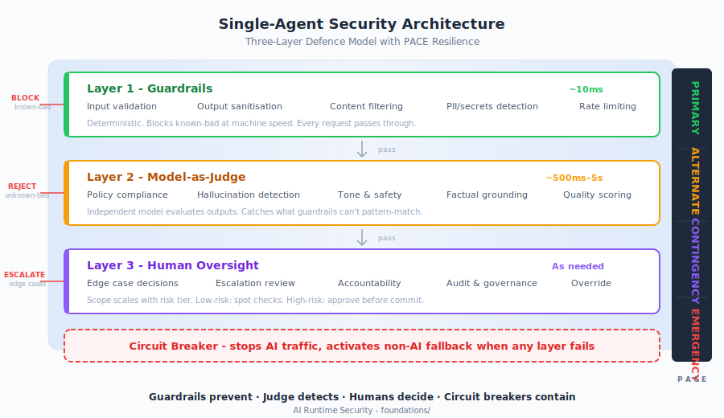

# Architecture Overview

<!-- golden-thread-nav -->
!!! tip "Part of the Golden Thread (13 of 14)"
    Previous: [The Feedback Loops That Make It Work](insights/feedback-loops.md) · Next: [What Works](insights/what-works.md) · [See the full sequence](reading-paths.md#the-golden-thread-guardrails-judges-and-why-they-work-together)
<!-- golden-thread-nav -->

The goal of this architecture is to reduce harm caused by AI systems in production through layered controls that are proportionate to risk. Not every AI use case needs every control. The architecture provides risk-oriented paths so that AI product owners can quickly identify the controls they need and apply them, or consciously deselect the ones they do not need.

## The Pattern

{ .arch-diagram }

The industry is converging on the same answer independently. NVIDIA NeMo, AWS Bedrock, Azure AI, LangChain, Guardrails AI: all implement variants of four independent layers.

| Layer | What It Does | Speed |
| --- | --- | --- |
| **Guardrails** | Block known-bad inputs and outputs: PII, injection patterns, policy violations | Real-time (~10ms) |
| **Model-as-Judge** | Detect unknown-bad: an independent model (SLM or LLM, optionally [distilled](extensions/technical/distill-judge-slm.md)) evaluating whether responses are appropriate | Async (500ms–5s) or inline (10–50ms for SLM) |
| **Human Oversight** | Decide genuinely ambiguous cases that automated layers cannot resolve | As needed |
| **Circuit Breaker** | Stop all AI traffic and activate a safe fallback when controls themselves fail | Immediate |

**Guardrails prevent. Judge detects. Humans decide. Circuit breakers contain.**

Each layer catches what the others miss. Remove any layer and you have a gap. Together they form a **closed-loop control system**: containment boundaries define the desired state, the Judge continuously measures actual behaviour, drift detection computes the error, and human oversight applies corrective action. Unlike open-loop approaches that evaluate once and deploy, this architecture self-corrects continuously. See [Why Containment Beats Evaluation](insights/why-containment-beats-evaluation.md) and [The Feedback Loops That Make It Work](insights/feedback-loops.md).

## Single-Agent Architecture

{ .arch-diagram }

For a single AI model, a chatbot, a document processor, an assistant, the four layers wrap the model's input and output. What matters in practice is not the existence of each layer but the choices inside each one:

- **Guardrails are a [constrain-regardless](insights/why-containment-beats-evaluation.md) architecture.** Action-space constraints that leave the model's reasoning unconstrained. Permissions derive from **business intent**, what the use case requires, not from evaluation of the model's capabilities. Necessary but insufficient alone: you cannot write a regex for every possible failure of a system that generates natural language.

- **The Judge must be independent.** A [distilled SLM](extensions/technical/distill-judge-slm.md) sidecar for real-time screening, or a large LLM running asynchronously. Either way, different model, different provider if possible, **enterprise-owned and configured**, not vendor-side safeguards. If the primary model is compromised, the Judge must not be compromised with it. This is where within-bounds adversarial behaviour is caught, which containment alone cannot address.

- **Human oversight scales with risk, not with volume.** Only genuinely ambiguous cases reach reviewers. Low-risk systems get spot checks, high-risk systems get human approval before execution. If every output goes to a reviewer, the reviewers stop reading, and oversight degrades to theatre.

- **Circuit breakers are not a degradation.** When detection confirms compromise or the layers themselves fail, AI traffic stops and a non-AI fallback takes over. No half-measures, no partial service. The Emergency state is a predetermined safe state, not a guess.

Controls scale to risk tier. A low-risk internal tool needs minimal guardrails and self-certification ([Fast Lane](FAST-LANE.md)). A customer-facing agent handling regulated data needs the full architecture with mandatory human approval. The framework respects that every organisation has its own way of working, and lets you match controls to context rather than imposing a single mandate.

**→ [Foundation Framework](foundations/README.md)** · the three-layer behavioural pattern with risk tiers and implementation checklists, backed by 80 [infrastructure controls](infrastructure/README.md) across 11 domains.

## Multi-Agent Architecture

The four-layer pattern holds for single models. When multiple LLMs collaborate, delegate, and take autonomous actions, new failure modes emerge that single-agent controls cannot catch:

- **Prompt injection propagates** across agent chains: one poisoned document becomes instructions for every downstream agent.
- **Hallucinations compound**: Agent A hallucinates a claim, Agent B cites it as fact, Agent C elaborates with high confidence.
- **Delegation creates transitive authority**: permissions transfer implicitly through delegation chains nobody designed.
- **Failures look like success**: the most dangerous outputs are well-formatted, confident, unanimously agreed, and wrong.

Multi-agent security requires per-agent identity, per-agent permissions, and per-agent evaluation, plus controls for the interactions between agents: message bus security, epistemic integrity, kill switch architecture. Same principles as the single-agent pattern, extended to the space between models.

**→ [MASO Framework](maso/README.md)** · controls across 10 domains, 3 implementation tiers, full OWASP dual coverage.

## When Layers Fail: PACE Resilience

Every control has a defined failure mode. Detection catches most of them, but not all. The [PACE methodology](PACE-RESILIENCE.md) ensures that when a layer degrades, and it will, the system transitions to a predetermined safe state rather than failing silently.

| State | What's happening |
| --- | --- |
| **Primary** | All layers operational. Normal production. |
| **Alternate** | One layer degraded. Backup active. Scope tightened. |
| **Contingency** | Multiple layers degraded. Supervised-only mode. Human approves every action. |
| **Emergency** | Confirmed compromise. Circuit breaker fired. AI stopped. Non-AI fallback active. |

Even at the lowest risk tier, there is a fallback plan. At the highest, there is a structured degradation path from full autonomy to full stop. The architecture does not assume the layers are perfect; it assumes they will each fail at some point, and designs for that.

!!! info "References"
    - [Foundation Framework](foundations/README.md)
    - [MASO Framework](maso/README.md)
    - [PACE Resilience](PACE-RESILIENCE.md)
    - [Why Containment Beats Evaluation](insights/why-containment-beats-evaluation.md)
    - [The Feedback Loops That Make It Work](insights/feedback-loops.md)
