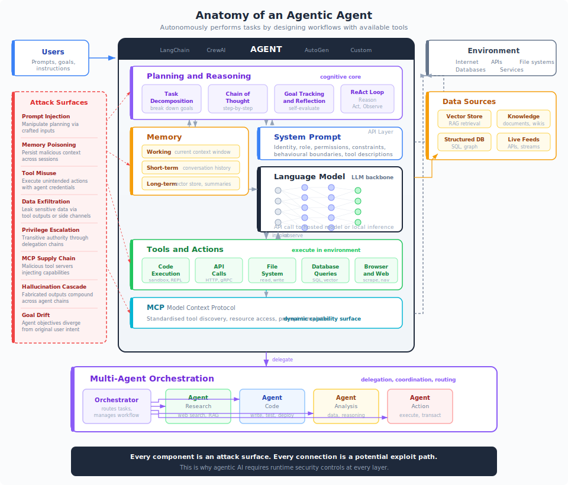
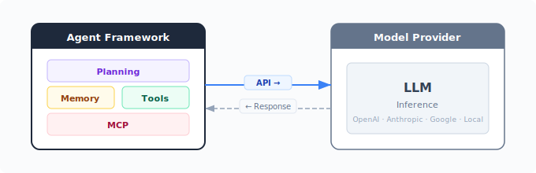

# Anatomy of an Agentic Agent

Before you can secure an agent, you need to understand what one actually is. An agentic agent is not just a language model answering questions. It is a software system that autonomously performs tasks by designing workflows with available tools. That distinction changes everything about how you think about security.

{ .arch-diagram }

## What Makes It an Agent

A chatbot receives a prompt and returns a response. An agent receives a goal and decides how to achieve it. It plans, acts, observes results, adjusts, and continues until the goal is met or it determines it cannot proceed. This autonomy is what makes agents useful. It is also what makes them dangerous.

| Capability | Chatbot | Agent |
|-----------|---------|-------|
| **Interaction** | Single turn, reactive | Multi-step, self-directed |
| **Actions** | Generates text | Executes real-world actions |
| **Scope** | Fixed by prompt | Expands based on reasoning |
| **Persistence** | Stateless between turns | Maintains memory across steps |
| **Failure mode** | Wrong answer | Wrong action with consequences |

## The Components

### Planning and Reasoning

The planning layer is the agent's cognitive core. It takes a high-level goal and breaks it into executable steps. This typically involves:

- **Task decomposition.** Breaking a complex goal ("research competitors and draft a report") into discrete subtasks.
- **Chain-of-thought reasoning.** Working through problems step by step, making the reasoning process explicit.
- **Goal tracking and reflection.** Monitoring progress, evaluating whether intermediate results are on track, and adjusting the plan.
- **The ReAct loop.** The dominant pattern in modern agents: **Reason** about what to do next, **Act** by calling a tool, **Observe** the result, then repeat. This tight loop is what gives agents their autonomy.

!!! warning "Security implication"
    The planning layer is where prompt injection does the most damage. A well-crafted injection does not just produce a bad response. It hijacks the agent's planning, causing it to pursue an attacker's goals while believing it is following the user's instructions.

### Memory

Agents maintain state across steps and sessions through multiple memory types:

- **Working memory** is the current context window. Everything the model can "see" right now: the system prompt, conversation history, tool results, and retrieved context. This is bounded by the model's context length.
- **Short-term memory** is the conversation history within a session. As the context window fills, agents summarise or drop earlier messages.
- **Long-term memory** persists across sessions. This typically uses vector stores, structured databases, or summary logs. The agent retrieves relevant memories when they might help with the current task.

Memory gives agents continuity. It also gives attackers persistence. A malicious instruction embedded in long-term memory can influence agent behaviour across sessions, long after the original attack, a problem explored in depth in [The Memory Problem](insights/the-memory-problem.md).

### System Prompt

The system prompt defines the agent's identity, role, permissions, and behavioural boundaries. It describes what tools are available, how to use them, and what constraints apply. Think of it as the agent's operating manual.

In practice, system prompts are the primary mechanism for controlling agent behaviour. They are also the most fragile. System prompts are not enforced by the runtime. They are suggestions that the model follows most of the time, but can be overridden by sufficiently clever inputs. This is the fundamental reason why [infrastructure beats instructions](insights/infrastructure-beats-instructions.md).

### Language Model

The language model is the agent's backbone. It does not execute tools, store memory, or interact with the environment directly. What it does is generate text: the next step in a plan, the arguments for a tool call, the response to a user.

The agent framework makes an API call to the model (hosted by a provider like OpenAI, Anthropic, Google, or running locally), passes the current context, and receives a completion. That completion might be a natural language response, a structured tool call, or a reasoning trace. The framework parses it and acts accordingly.

Key characteristics that matter for security:

- **The model is not deterministic.** The same input can produce different outputs. You cannot unit-test an agent the way you test traditional software.
- **The model is opaque.** You cannot inspect why it decided to call a specific tool with specific arguments. You can only observe the output.
- **The model is someone else's.** In most deployments, the model runs on infrastructure you do not control. Model updates happen without your knowledge and can change agent behaviour overnight. See [You Don't Know What You're Deploying](insights/you-dont-know-what-youre-deploying.md).

### Tools and Actions

Tools are what separate agents from chatbots. A tool is any function the agent can invoke: an API call, a database query, a code execution environment, a file system operation, a web browser.

The agent decides which tool to call and what arguments to pass. The framework executes the tool, captures the result, and feeds it back to the model as an observation. The model then reasons about the result and decides what to do next.

Tools execute with the agent's credentials and permissions. If the agent has a database connection, every tool call can query that database. If the agent has an API key, every tool call can use it. There is no per-tool permission model by default. The agent's blast radius is the union of everything its tools can reach.

!!! abstract "The two core problems"
    Agentic security reduces to two questions. **Does the agent access only the right systems?** (system access). **Does the action match the user's actual intent?** (request integrity). Both must hold for every tool call. See [Agentic AI Controls](core/agentic.md) for the full framework.

### MCP: Model Context Protocol

MCP is an open standard that provides a uniform interface for agents to discover and use tools, access resources, and receive prompt templates from external servers. Instead of hardcoding tool integrations, an agent connects to MCP servers that expose capabilities dynamically.

This solves an integration problem. It also creates a supply chain problem. When tools are discovered at runtime from external servers, the agent's capability surface is no longer defined at deployment time. A compromised or malicious MCP server can inject new capabilities, modify existing ones, or expose resources the agent was never intended to access. This is the challenge explored in [The MCP Problem](insights/the-mcp-problem.md) and addressed by [Supply Chain Controls](maso/controls/supply-chain.md).

## How Agents Connect to Models

The agent framework does not contain a language model. It makes API calls to one. This separation is important.

{ .arch-diagram }

The framework constructs a prompt (system instructions, conversation history, tool results, retrieved context), sends it to the model, and parses the response. The model has no persistent state between calls. Every API call is independent. The framework is responsible for maintaining continuity.

This means:

- **The model sees only what the framework sends.** Context management is a framework concern, not a model concern.
- **Tool execution happens in the framework, not the model.** The model generates a tool call specification. The framework executes it. This is why tool permissions must be enforced at the framework level.
- **Model provider changes affect agent behaviour.** A model update, a new safety filter, a changed default temperature can all alter how the agent plans and acts, with no change to your code.

## How Agents Interact with Their Environment

An agent's environment is everything outside the agent that it can observe or affect. This includes:

| Surface | Access Method | Risk |
|---------|--------------|------|
| **Internet** | HTTP requests, web browsing | Data exfiltration, fetching malicious content |
| **APIs** | REST, gRPC, webhooks | Unauthorised actions in external services |
| **File systems** | Read/write operations | Data theft, malware deployment |
| **Databases** | SQL queries, vector search | Data leakage, injection attacks |
| **Other agents** | Message passing, delegation | Privilege escalation, hallucination cascading |
| **Users** | Conversational interface | Social engineering, prompt injection |

Every environment interaction is bidirectional. The agent sends data out (tool calls, API requests) and receives data back (tool results, API responses). Both directions are attack vectors. Outbound interactions can exfiltrate data. Inbound results can contain injected instructions that hijack the agent's planning.

## Multi-Agent Orchestration

When a single agent is insufficient, multiple agents collaborate through orchestration. An orchestrator agent receives a high-level goal, decomposes it, and delegates subtasks to specialised agents: a research agent, a coding agent, an analysis agent, an action agent.

This creates emergent risks that do not exist in single-agent systems:

- **Transitive authority.** Agent A delegates to Agent B, which delegates to Agent C. Permissions transfer implicitly through the delegation chain.
- **Hallucination cascading.** Agent A fabricates a claim. Agent B treats it as fact. Agent C elaborates with high confidence. The error compounds at each step.
- **Confused deputy.** An agent acts on behalf of another agent, using its own credentials but following potentially manipulated instructions.
- **Coordination failures.** Agents make conflicting assumptions, duplicate work, or deadlock waiting for each other.

For controls designed specifically for these failure modes, see [Multi-Agent Controls](core/multi-agent-controls.md) and the [MASO Framework](maso/README.md).

## Why This Architecture Creates Security Challenges

Traditional software security assumes deterministic behaviour, inspectable logic, and well-defined interfaces. Agentic agents break all three assumptions:

**Non-deterministic behaviour.** The same input can produce different plans, different tool calls, different outcomes. You cannot exhaustively test an agent. You must constrain it at runtime.

**Opaque decision-making.** You cannot inspect the model's reasoning to determine whether a tool call is legitimate or the result of prompt injection. You can only observe the action and evaluate whether it falls within acceptable bounds.

**Dynamic capability surface.** Through MCP and tool discovery, an agent's capabilities can change between deployments or even between requests. The attack surface is not fixed at build time.

**Compounding failures.** In multi-agent systems, errors do not stay local. They propagate through delegation chains, amplifying at each step. A single poisoned document can become instructions for an entire agent swarm.

**Credential aggregation.** An agent accumulates the permissions of every tool it can access. Compromise of the agent compromises everything it can reach.

This is why agents require runtime security, not just pre-deployment testing. The [AIRS Architecture](ARCHITECTURE.md) provides the layered control model. [MASO](maso/README.md) extends it for multi-agent systems. Both start from the same premise: you must control what agents can do, not just what they are told to do.

!!! info "References"
    - [Agentic AI Controls](core/agentic.md)
    - [AIRS Architecture Overview](ARCHITECTURE.md)
    - [MASO Framework](maso/README.md)
    - [The MCP Problem](insights/the-mcp-problem.md)
    - [The Memory Problem](insights/the-memory-problem.md)
    - [Infrastructure Beats Instructions](insights/infrastructure-beats-instructions.md)
    - [When Agents Talk to Agents](insights/when-agents-talk-to-agents.md)
    - [The Orchestrator Problem](insights/the-orchestrator-problem.md)
    - [You Don't Know What You're Deploying](insights/you-dont-know-what-youre-deploying.md)
