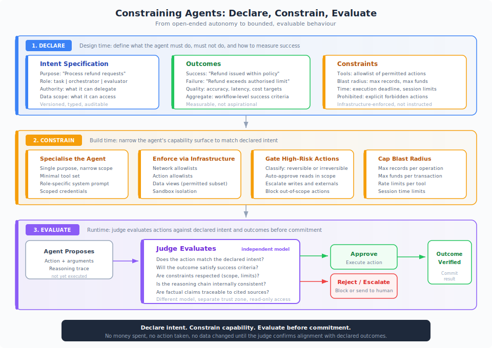

# Constraining Agents

An [agentic agent](agentic-agent-anatomy.md) is a system that autonomously plans and acts. Left unconstrained, it will use whatever tools it can reach, access whatever data it can find, and pursue its goal in whatever way its reasoning suggests. That flexibility is the point of agents. It is also the source of most security failures.

The solution is not to remove autonomy. It is to bound it. Declare what the agent is for, what outcomes it must deliver, and what constraints it operates under. Then use a judge model to verify that every action aligns with those declarations before anything is committed.

{ .arch-diagram }

## The Three Phases

Constraining an agent happens in three phases: **declare** at design time, **constrain** at build time, **evaluate** at runtime. Each phase narrows the agent's action space. Together they ensure that no money is spent, no action taken, and no data changed until the system has confirmed alignment with declared outcomes.

## Phase 1: Declare

Before writing any code, define three things about the agent.

### Intent

What is this agent for? Not a vague mission statement. A specific, typed declaration of purpose that a judge model can evaluate against.

| Element | Bad Example | Good Example |
|---------|-------------|--------------|
| **Purpose** | "Help with customer issues" | "Process refund requests for orders under 90 days old" |
| **Role** | "Assistant" | "Task agent: refund processing. No delegation authority." |
| **Data scope** | "Customer data" | "Read: orders, returns. Write: refunds. No access to payment instruments." |
| **Authority** | "Handle requests" | "May issue refunds up to $500. Must escalate above $500." |

This is the **intent specification**: a versioned, auditable artifact that sits alongside the agent's configuration. It is the reference point that every downstream control uses. If you know what an agent is supposed to do, every layer of defence has something to evaluate against. If you do not, you are guessing.

For the full architecture of intent-based evaluation, see [Containment Through Declared Intent](insights/containment-through-intent.md) and [The Intent Layer](insights/the-intent-layer.md).

### Outcomes

What does success look like? What does failure look like? Define both in measurable terms.

**Success criteria** are the conditions under which the agent's output should be accepted:

- Refund issued within policy limits
- Customer notified with correct details
- Audit trail complete with reasoning trace

**Failure criteria** are the conditions that should trigger rejection or escalation:

- Refund exceeds authorised limit
- Customer identity not verified
- Agent accessed data outside its declared scope

**Aggregate outcomes** matter when multiple agents collaborate. Each agent may individually succeed while the combined workflow fails. A research agent retrieves accurate data, a drafting agent produces a well-structured report, but the report contradicts the research because context was lost in the handoff. Individual agent compliance does not guarantee system-level success.

### Constraints

What boundaries does the agent operate within? Constraints define the walls of the agent's action space.

- **Tool allowlist.** Which tools the agent may use. Everything else is denied by default.
- **Blast radius caps.** Maximum records per query, maximum funds per transaction, maximum API calls per session.
- **Time boundaries.** Execution deadline, session duration limits.
- **Prohibited actions.** Explicit list of things the agent must never do, regardless of reasoning.
- **Output constraints.** Format, length, content restrictions on what the agent produces.

!!! warning "Instructions are not constraints"
    Writing "never access the payments database" in a system prompt is an instruction. The agent will usually follow it. But a well-crafted prompt injection can override it. A constraint is a network rule that blocks the connection, a credential that lacks the permission, a data view that hides the table. [Infrastructure beats instructions](insights/infrastructure-beats-instructions.md), every time.

## Phase 2: Constrain

With intent, outcomes, and constraints declared, build the agent to match.

### Specialise the Agent

A general-purpose agent with access to everything is the hardest thing to secure and the hardest thing to evaluate. A specialist agent with a narrow purpose is both easier to constrain and easier to judge.

| Approach | General-Purpose Agent | Specialist Agent |
|----------|----------------------|------------------|
| **Scope** | "Handle customer requests" | "Process refund requests" |
| **Tools** | 20 tools across 5 systems | 3 tools in the refund system |
| **Credentials** | Broad access token | Scoped to refund API only |
| **Evaluation** | "Was the response appropriate?" | "Was the refund within policy?" |
| **Blast radius** | Entire customer platform | Refund ledger, capped at $500 |

Specialist agents are not just a security pattern. They produce better outcomes. A narrower scope means fewer distractions, fewer irrelevant tools, and a clearer system prompt. The agent's reasoning stays focused on its declared purpose rather than navigating a sprawling capability surface.

When a task requires multiple capabilities, use multiple specialist agents coordinated by an orchestrator, not one agent that tries to do everything. This mirrors how organisations work: you do not give one employee access to HR, finance, legal, and engineering systems. You assign roles with scoped access.

### Enforce via Infrastructure

Every constraint declared in Phase 1 should be enforced by infrastructure, not by the system prompt alone.

| Declared Constraint | Infrastructure Enforcement |
|--------------------|---------------------------|
| "Access refund data only" | Database view exposing only the refund tables |
| "No external API calls" | Network allowlist blocking all non-approved endpoints |
| "Maximum $500 per refund" | API gateway validating amount parameter |
| "No access to payment instruments" | Credential lacks permission on payment APIs |
| "Code execution in sandbox" | Container isolation with no network egress |

The system prompt should describe these constraints so the agent understands them. But the enforcement must exist at the infrastructure level. If the agent is fully compromised, the infrastructure constraints still hold. That is the test.

### Classify and Gate Actions

Not every action needs the same level of scrutiny. Classify actions by reversibility and impact, then gate accordingly.

**Auto-approve:** Reads within declared scope, low-consequence writes within pre-approved parameter ranges, actions the judge has already cleared for this pattern.

**Escalate:** Writes to production systems, communications to external parties, irreversible operations, actions the judge flags, anything approaching blast radius caps.

**Block:** Actions outside the tool allowlist, guardrail violations, access to out-of-scope systems, anything prohibited in the intent specification.

This classification is not static. As the agent builds trust through consistent behaviour (evaluated against its declared outcomes), the approval threshold can shift. But the shift should be deliberate, documented, and reversible. See the [implementation tiers](maso/implementation/tier-1-supervised.md) for how this progression works in practice.

## Phase 3: Evaluate

Declarations and infrastructure constraints handle most risks. But agents reason in natural language, and natural language is inherently ambiguous. An agent can stay within its tool allowlist and credential scope while still pursuing a manipulated goal, hallucinating facts, or drifting from the user's actual intent. This is where the judge model comes in.

### What the Judge Evaluates

The judge is an independent model (different from the agent, ideally from a different provider) that evaluates the agent's proposed actions against the declarations from Phase 1.

For every action the agent proposes, the judge asks:

1. **Does this action match the declared intent?** Is the agent doing what it was designed to do, or has it drifted?
2. **Will the outcome satisfy the success criteria?** Based on the proposed action and its likely result, will this move toward or away from the declared outcomes?
3. **Are the declared constraints respected?** Is the action within scope, within limits, within the permitted tool set?
4. **Is the reasoning chain internally consistent?** Does the agent's explanation for why it is taking this action make sense, or does it show signs of manipulation?
5. **Are factual claims grounded?** If the action depends on facts, are those facts traceable to cited sources, or are they hallucinated?

The judge operates in a separate trust zone with read-only access to the agent's context and audit logs. It cannot modify the agent's state. It can only approve, reject, or escalate.

### When to Evaluate

The timing of evaluation depends on risk.

| Risk Level | Evaluation Timing | Example |
|-----------|-------------------|---------|
| **Low** | Post-action (async) | Logging a note, reading a document |
| **Medium** | Pre-action (sync) | Sending an email, updating a record |
| **High** | Pre-action with human review | Issuing a payment, modifying access controls |
| **Critical** | Pre-action, dual approval | Deploying code, bulk data operations |

For elevated-risk actions, the judge evaluates *before* the action executes. The agent proposes an action, the judge assesses it, and only approved actions proceed. This is the pattern that ensures no money is spent and no irreversible change is made without verification against declared outcomes.

For the detailed implementation of judge evaluation, see [Model-as-Judge Implementation](extensions/technical/model-as-judge-implementation.md) and [Judge Assurance](core/judge-assurance.md).

### Tactical and Strategic Evaluation

In multi-agent systems, evaluation happens at two levels.

**Tactical evaluation** assesses each individual agent against its own intent specification. Did the research agent retrieve relevant, accurate sources? Did the drafting agent produce output consistent with those sources?

**Strategic evaluation** assesses the aggregate workflow against its overall intent specification. Even if every agent individually passed its tactical evaluation, the combined output may fail at the workflow level. The strategic evaluator catches emergent failures that no single agent's evaluation would detect: contradictions between agents, context lost in delegation, conclusions that do not follow from the evidence.

Both levels use the same declared intent and outcomes as their reference point. The difference is scope: tactical evaluation checks one agent, strategic evaluation checks the system.

## Putting It Together

The full pattern looks like this:

1. **Declare** the agent's intent, outcomes, and constraints as versioned specifications.
2. **Specialise** the agent for a narrow purpose with minimal tools.
3. **Enforce** constraints through infrastructure, not instructions.
4. **Classify** actions by risk and gate accordingly.
5. **Evaluate** proposed actions against declarations using an independent judge.
6. **Commit** only when the judge confirms alignment with declared outcomes.

This is not about preventing agents from being useful. It is about making their usefulness legible and verifiable. An agent that can explain what it is doing, why, and how that aligns with its declared purpose is an agent you can trust proportionally. An agent that cannot is an agent you cannot govern.

!!! abstract "The foundation for MASO"
    This declare-constrain-evaluate pattern is the foundation of the [MASO Framework](maso/). MASO extends it across 10 control domains, covering identity, data protection, execution control, observability, supply chain security, privileged-agent governance, model cognition assurance, agentic task contracts, objective intent, and prompt/goal/epistemic integrity. If you are deploying agents at scale, start here to understand the principles, then move to MASO for the full control set.

!!! info "References"
    - [Anatomy of an Agentic Agent](agentic-agent-anatomy.md)
    - [Containment Through Declared Intent](insights/containment-through-intent.md)
    - [The Intent Layer](insights/the-intent-layer.md)
    - [Infrastructure Beats Instructions](insights/infrastructure-beats-instructions.md)
    - [Agentic AI Controls](core/agentic.md)
    - [Model-as-Judge Implementation](extensions/technical/model-as-judge-implementation.md)
    - [Judge Assurance](core/judge-assurance.md)
    - [MASO Framework](maso/)
    - [Tier 1: Supervised Implementation](maso/implementation/tier-1-supervised.md)
