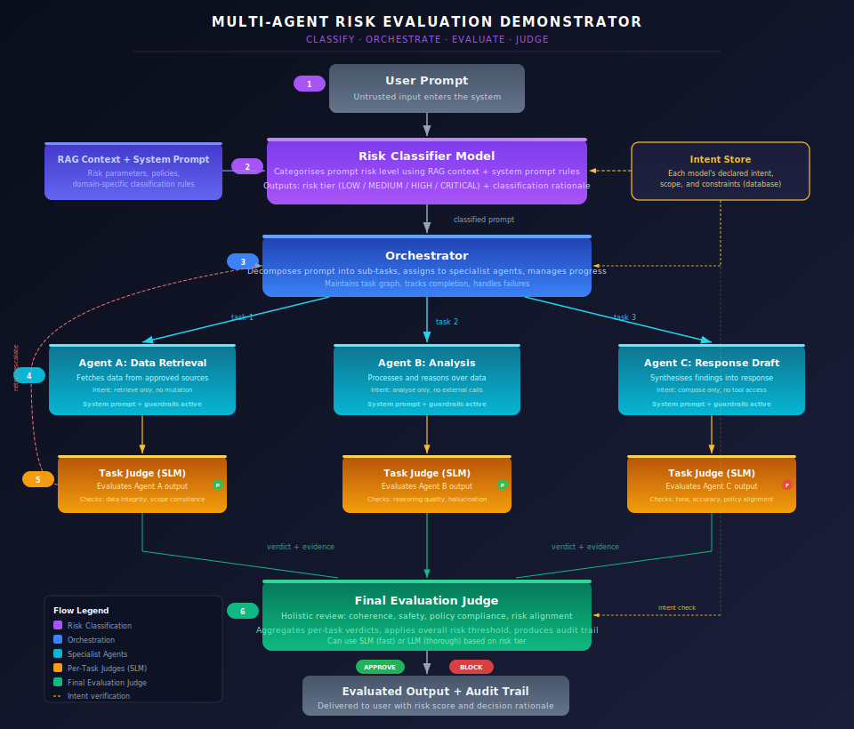
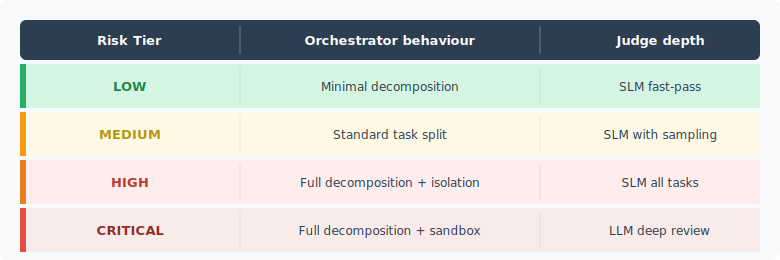

# Multi-Agent Risk Evaluation Demonstrator

This demonstrator walks through the end-to-end flow of a prompt as it moves through a multi-agent system with layered risk evaluation. Every model in the pipeline has a declared **intent statement** stored in a central intent store (database), and every step is observable.

{ .arch-diagram }

## How it works

The system has six stages. Each stage is visible to operators and auditors in real time.

### Step 1: User prompt enters the system

A user submits a natural-language prompt. At this point, the input is **untrusted**. No assumptions are made about intent, safety, or scope.

### Step 2: Risk Classifier assigns a risk tier

A dedicated classification model examines the prompt. It draws on two sources:

- **RAG context and system prompt rules** that define the organisation's risk taxonomy, policies, and domain-specific classification logic.
- **Intent Store lookups** that retrieve the declared intent statements for downstream models, so the classifier can assess whether the prompt falls within the system's operational scope.

The classifier outputs a **risk tier** (LOW, MEDIUM, HIGH, or CRITICAL) along with a rationale. This tier shapes how aggressively the orchestrator and judges operate.

{ .arch-diagram }

### Step 3: Orchestrator decomposes and assigns

The orchestrator receives the classified prompt and breaks it into sub-tasks. Each task is assigned to a **specialist agent** based on capability, scope, and the principle of least privilege.

The orchestrator:

- Maintains a **task graph** tracking dependencies, completion status, and failures.
- Enforces **delegation contracts** that specify what each agent is allowed to do.
- Reads each agent's **intent statement** from the intent store before dispatch, confirming the task matches the agent's declared scope.
- Manages **retries and escalation** when per-task judges flag problems.

### Step 4: Specialist agents execute their tasks

Each agent operates within strict boundaries defined by its system prompt and guardrails:

| Agent | Scope | Intent constraint |
|-------|-------|-------------------|
| **Agent A: Data Retrieval** | Fetches data from approved sources | Read-only, no mutation |
| **Agent B: Analysis** | Processes and reasons over data | No external calls, no tool access |
| **Agent C: Response Draft** | Synthesises findings into a response | Compose only, no tool access |

Every agent has:

- A **system prompt** that defines its role and boundaries.
- **Input/output guardrails** that filter known-bad patterns.
- A **declared intent** in the intent store that the judges verify against.

### Step 5: Per-task judges evaluate each agent (SLM)

Each agent's output is evaluated by a small language model (SLM) acting as a **task judge**. These judges run in near real-time and check:

| Judge for | Checks |
|-----------|--------|
| Agent A | Data integrity, source approval, scope compliance |
| Agent B | Reasoning quality, hallucination detection, chain-of-thought coherence |
| Agent C | Tone, factual accuracy, policy alignment, no leaked instructions |

Each judge produces a **verdict** (pass, fail, or flag) with supporting evidence. Failed tasks trigger one of:

- **Retry**: the orchestrator re-dispatches the task with tighter constraints.
- **Escalation**: the task is routed to the final judge or a human reviewer.

### Step 6: Final Evaluation Judge delivers the overall verdict

The final judge aggregates all per-task verdicts and performs a holistic review:

- **Coherence**: do the combined agent outputs form a consistent, non-contradictory answer?
- **Safety**: does the assembled response violate any safety policy?
- **Policy compliance**: is the response within the organisation's acceptable use boundaries?
- **Risk alignment**: does the final output match what the risk tier permits?

The final judge can be an **SLM** (for LOW/MEDIUM tiers where speed matters) or an **LLM** (for HIGH/CRITICAL tiers where thoroughness matters). Its output is a decision: **APPROVE** or **BLOCK**, with a full audit trail attached.

## The Intent Store

Every model in the pipeline has a record in the intent store:

```json
{
  "model_id": "agent-b-analysis-v2",
  "intent": "Analyse retrieved data using reasoning. No external API calls. No tool invocations. Output structured analysis only.",
  "scope": ["data_analysis", "reasoning"],
  "constraints": ["no_external_calls", "no_tool_use", "no_mutation"],
  "risk_ceiling": "HIGH",
  "last_verified": "2026-03-21T00:00:00Z"
}
```

Judges compare actual behaviour against declared intent. A mismatch (for example, an analysis agent attempting an external API call) triggers an immediate block, regardless of whether the output looks correct.

## What users see

The demonstrator is designed so that observers can follow the entire flow:

1. **Prompt entry**: the raw user input is displayed.
2. **Risk classification**: the assigned tier and rationale appear alongside the prompt.
3. **Task decomposition**: the orchestrator's task graph is shown, with each sub-task and its assigned agent.
4. **Agent execution**: each agent's input, output, and active guardrails are visible.
5. **Per-task verdicts**: pass/fail indicators with evidence are shown next to each agent.
6. **Final verdict**: the overall decision (APPROVE/BLOCK) with the aggregated audit trail.

Each stage lights up as the system processes the prompt, making the decision pipeline transparent from start to finish.

## Mapping to AIRS controls

| Demonstrator stage | AIRS control |
|--------------------|--------------|
| Risk Classifier | [Risk Tiers](../../core/risk-tiers.md), [Risk Assessment](../../core/risk-assessment.md) |
| Orchestrator | [Multi-Agent Controls](../../core/multi-agent-controls.md), [Delegation Chains](../../infrastructure/agentic/delegation-chains.md) |
| Specialist Agents | [Agentic AI Controls](../../core/agentic.md), [Tool Access Controls](../../infrastructure/agentic/tool-access-controls.md) |
| Per-Task Judges | [Judge Assurance](../../core/judge-assurance.md), [Model-as-Judge Implementation](../technical/model-as-judge-implementation.md) |
| Final Judge | [Judge Model Selection](../technical/judge-model-selection.md), [Distilling the Judge into an SLM](../technical/distill-judge-slm.md) |
| Intent Store | [Identity & Access](../../infrastructure/controls/identity-and-access.md) |

!!! info "References"
    - [Risk Tiers](../../core/risk-tiers.md)
    - [Multi-Agent Controls](../../core/multi-agent-controls.md)
    - [Judge Assurance](../../core/judge-assurance.md)
    - [Model-as-Judge Implementation](../technical/model-as-judge-implementation.md)
    - [Delegation Chains](../../infrastructure/agentic/delegation-chains.md)
    - [Agentic AI Controls](../../core/agentic.md)
