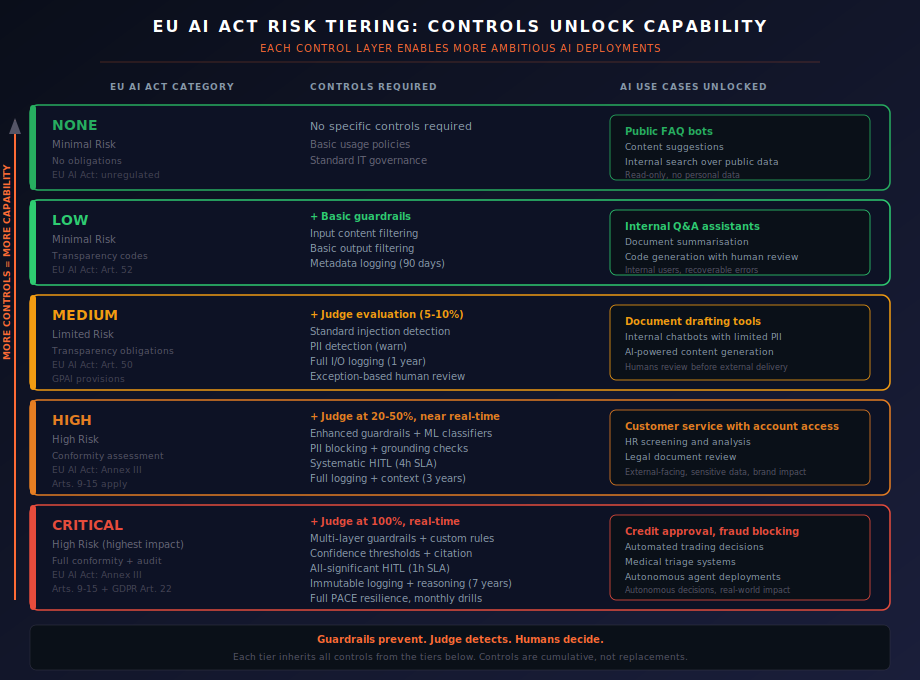
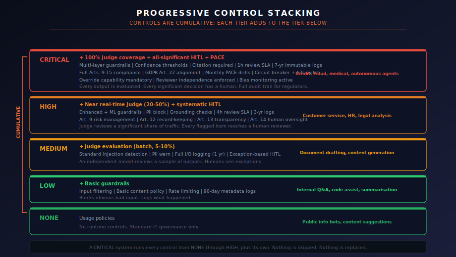

# EU AI Act Risk Tiering: What Controls Let You Do

Every organisation wants to know the same thing: *what AI can we actually deploy?*

The answer depends on what controls you have in place. The EU AI Act codifies this principle into law: higher-risk AI systems require stronger controls. This page maps that regulatory framework to practical deployment decisions. It shows, tier by tier, which controls you need and what those controls let you build.

The logic is simple. More controls, more capability. Not because bureaucracy demands it, but because controls are what make ambitious AI deployments safe enough to operate.

## The EU AI Act Risk Framework

The EU AI Act classifies AI systems into four regulatory categories based on the risk they pose to health, safety, and fundamental rights. This framework maps those categories to five operational tiers, splitting the highest category to distinguish between systems that influence decisions and systems that make them autonomously.

| EU AI Act Category | Framework Tier | Regulatory Obligation | What You Can Build |
|---|---|---|---|
| Minimal Risk | **NONE** | No specific requirements | Public info bots, content suggestions |
| Minimal Risk | **LOW** | Voluntary codes of practice | Internal assistants, summarisation tools |
| Limited Risk | **MEDIUM** | Transparency obligations (Art. 50) | Document drafting, content generation |
| High Risk (Annex III) | **HIGH** | Conformity assessment (Arts. 9-15) | Customer service, HR screening, legal review |
| High Risk (highest impact) | **CRITICAL** | Full conformity + ongoing audit | Credit decisions, fraud blocking, medical triage |

!!! warning "Unacceptable Risk"
    The EU AI Act prohibits certain AI practices entirely (Art. 5): social scoring, real-time remote biometric identification in public spaces (with narrow exceptions), exploitation of vulnerabilities, and subliminal manipulation. No amount of controls makes these deployable. They are out of scope for this framework because they should not be built.

## How Controls Unlock Capability

This is the core message: **controls are not a tax on AI deployment. They are the mechanism that makes higher-value AI deployments possible.**

Without guardrails, you cannot safely deploy a customer-facing chatbot. Without a Judge, you cannot detect when outputs drift from policy. Without human oversight, you cannot satisfy the EU AI Act's Article 14 requirements for high-risk systems. Each control layer removes a class of risk that would otherwise block deployment.

{ .arch-diagram }

## Tier-by-Tier Breakdown

### NONE: No Runtime Controls

**EU AI Act category:** Minimal Risk (no obligations)

**Controls:** Standard IT governance. Usage policies. No runtime AI-specific controls.

**What this enables:**

- Public FAQ bots answering questions from published documentation
- Content suggestion engines recommending articles or products
- Search tools over public datasets

**What you cannot do at this tier:**

- Process any personal data
- Influence decisions (even advisory)
- Face external users with anything beyond information retrieval

**Why this tier exists:** Not every AI deployment needs runtime controls. A bot that answers "What are your opening hours?" from a public FAQ is not a risk to fundamental rights. The EU AI Act explicitly leaves minimal-risk systems unregulated. Applying heavyweight controls here wastes resources that should go to higher tiers.

### LOW: Basic Guardrails

**EU AI Act category:** Minimal Risk (voluntary codes of practice)

**Controls added:**

| Control | Configuration |
|---------|---------------|
| Input guardrails | Basic content filtering, standard rate limiting |
| Output guardrails | Basic content filtering, PII warning |
| Logging | Metadata only, 90-day retention |
| Judge | Optional (1-5% sampling if deployed) |

**What this enables:**

- Internal Q&A assistants for employees
- Document summarisation over internal content
- Code generation tools where a developer reviews every output
- General-purpose lookup tools for internal users

**What the controls actually do:** Basic guardrails catch obvious problems: prompt injection attempts, content policy violations, and abuse patterns. Metadata logging gives you enough to investigate incidents. The audience is internal users with domain expertise who can spot errors. The controls provide a safety net, not a safety cage.

**EU AI Act alignment:** These systems fall below the regulatory threshold. The controls here are good practice, not legal obligations. They exist because even low-risk systems benefit from basic hygiene.

### MEDIUM: Judge Enters the Picture

**EU AI Act category:** Limited Risk (transparency obligations, Art. 50)

**Controls added (cumulative):**

| Control | Configuration |
|---------|---------------|
| Input guardrails | Standard injection detection, content policy |
| Output guardrails | Standard filtering, PII detection (warn) |
| Judge evaluation | 5-10% batch sampling (daily) |
| Human review | Exception-based (Judge flags and anomalies) |
| Logging | Full input/output, 1-year retention |

**What this enables:**

- Document drafting tools for external communications
- AI-powered content generation reviewed before publication
- Internal chatbots that access limited confidential data
- Workflow automation with human approval steps

**What the Judge adds:** This is where the second control layer activates. The Judge, a separate model evaluating your system's outputs, reviews a sample of transactions daily. It catches problems that guardrails miss: subtle policy violations, quality drift, emerging patterns that rules-based filters cannot detect. When the Judge flags something, it routes to a human reviewer.

This is the tier where the principle "Guardrails prevent. Judge detects. Humans decide." begins to operate as designed.

**EU AI Act alignment:** Art. 50 requires transparency: users must be informed they are interacting with an AI system. General-purpose AI model providers have additional obligations around technical documentation and copyright compliance.

### HIGH: Full Three-Layer Defence

**EU AI Act category:** High Risk (Annex III, Arts. 9-15)

**Controls added (cumulative):**

| Control | Configuration |
|---------|---------------|
| Input guardrails | Enhanced + ML-based classifiers, PII blocking |
| Output guardrails | Enhanced filtering, grounding checks required |
| Judge evaluation | 20-50% coverage, near real-time |
| Human review | Systematic queue, all flags reviewed, 4h SLA |
| Logging | Full + context, 3-year retention, enhanced protection |
| PACE resilience | Primary + Alternate pre-configured |
| Documentation | Risk management system, technical documentation |

**What this enables:**

- Customer service AI with access to account data
- HR screening and candidate analysis tools
- Legal document analysis and review assistance
- External-facing systems with brand and reputational impact
- Recommendations that are typically followed by decision-makers

**What the full three layers deliver:** At HIGH, all three control layers are working together at meaningful scale. Guardrails block known-bad patterns in real time. The Judge reviews a significant share of all traffic, catching drift and novel issues that guardrails miss. Human reviewers see every flagged item within four hours, with enough context to make informed decisions.

This is also where PACE resilience becomes a requirement. The system must have a defined fallback mode. If the primary control layer degrades, the system transitions to a pre-configured alternate rather than running unprotected.

**EU AI Act alignment:** This tier maps directly to the Act's high-risk requirements:

| Article | Requirement | Framework Control |
|---------|-------------|-------------------|
| Art. 9 | Risk management system | Risk classification + three-layer control model |
| Art. 10 | Data governance | Data quality controls, bias testing |
| Art. 11 | Technical documentation | System documentation package |
| Art. 12 | Record-keeping | Full logging with 3-year retention |
| Art. 13 | Transparency | System documentation, user-facing disclosure |
| Art. 14 | Human oversight | Systematic HITL with 4h SLA |
| Art. 15 | Accuracy and security | Guardrails + Judge + validation |

### CRITICAL: Maximum Controls, Maximum Capability

**EU AI Act category:** High Risk (Annex III, highest impact systems)

**Controls added (cumulative):**

| Control | Configuration |
|---------|---------------|
| Input guardrails | Multi-layer + custom domain rules |
| Output guardrails | Maximum filtering, confidence thresholds, citation required |
| Judge evaluation | 100% coverage, real-time |
| Human review | All significant actions, 1h SLA, senior + expert reviewers |
| Logging | Full + reasoning chain, 7-year immutable retention |
| PACE resilience | Full P/A/C/E tested monthly |
| Override | Mandatory override and stop capability |
| Circuit breaker | Configured with automatic triggers |

**What this enables:**

- Credit approval and lending decisions
- Fraud detection and blocking systems
- Medical triage and clinical decision support
- Automated trading systems
- Autonomous agent deployments with write access
- Any system where errors are irreversible and affect individuals' rights

**What 100% Judge coverage means:** Every single output is evaluated by an independent model. Not a sample. Not a batch. Every transaction, in real time. The Judge does not block (that is the guardrail's role), but it surfaces every issue for human review within one hour. Combined with multi-layer guardrails and mandatory human oversight for all significant actions, this creates the strongest runtime assurance the framework provides.

**EU AI Act alignment:** CRITICAL tier systems face the full weight of Articles 9 through 15, plus GDPR Article 22 considerations. The framework's design, where the Judge detects but does not decide and humans make all consequential calls, specifically ensures decisions are not "solely automated." This is not incidental. The three-layer model was designed with this regulatory requirement in mind.

For the full article-by-article mapping, see the [EU AI Act Crosswalk](eu-ai-act-crosswalk.md).

## Progressive Control Stacking

Controls are cumulative. A CRITICAL system does not skip the controls from lower tiers. It runs all of them, plus its own.

{ .arch-diagram }

This is worth stating explicitly because organisations sometimes treat higher tiers as replacements rather than additions. A CRITICAL system with 100% Judge coverage but no input guardrails has a gap. The Judge evaluates outputs after they are generated. Guardrails prevent dangerous inputs from reaching the model at all. Both are needed. The question is intensity, not choice.

| Control | NONE | LOW | MEDIUM | HIGH | CRITICAL |
|---------|------|-----|--------|------|----------|
| **Input guardrails** | - | Basic | Standard | Enhanced + ML | Multi-layer |
| **Output guardrails** | - | Basic | Standard | Enhanced + grounding | Maximum + confidence |
| **Judge evaluation** | - | - | 5-10% batch | 20-50% near RT | 100% real-time |
| **Human oversight** | - | - | Exceptions | Systematic (4h) | All significant (1h) |
| **Logging** | - | Metadata, 90d | Full I/O, 1yr | Full + context, 3yr | Full + reasoning, 7yr |
| **PACE resilience** | - | - | Feature flag | P + A configured | Full P/A/C/E, monthly drill |
| **Override capability** | - | - | - | Available | Mandatory + tested |

## Making the Decision

Use this decision flow to determine your tier:

**Step 1: Check for prohibited practices.** Does your system involve social scoring, real-time biometric identification, subliminal manipulation, or exploitation of vulnerabilities? If yes, stop. The EU AI Act prohibits these outright.

**Step 2: Score your six dimensions.** For each dimension, pick the highest applicable answer:

| Dimension | NONE/LOW | MEDIUM | HIGH | CRITICAL |
|-----------|----------|--------|------|----------|
| Decision authority | Informational | Advisory | Influential | Autonomous |
| Reversibility | Fully reversible | Recoverable | Difficult | Irreversible |
| Data sensitivity | Public | Internal | Confidential/PII | Regulated |
| Audience | Internal technical | Internal general | External | External at scale |
| Scale | < 100/day | 100-10k/day | 10k-100k/day | > 100k/day |
| Regulatory status | Unregulated | Light-touch | Sector-regulated | AI Act high-risk |

**Step 3: Apply the highest score.** Your tier is determined by your highest-scoring dimension. A system that is LOW on five dimensions but HIGH on data sensitivity is a HIGH system.

**Step 4: Deploy the controls.** If your platform implements [automated risk tiering](../../insights/automated-risk-tiering.md), controls auto-apply. If not, use the [control matrix](../../core/risk-tiers.md) to identify what you need and the [implementation checklist](../../core/checklist.md) to verify readiness.

## What This Means for Your Organisation

The question is not "how much AI can we deploy?" It is "how much control infrastructure have we built?"

An organisation with basic guardrails deployed as a platform service can safely operate any LOW-tier AI system. Add a Judge evaluation pipeline and you unlock MEDIUM. Add systematic human review processes and full logging, and HIGH-tier deployments become viable. Build the complete stack, including PACE resilience, override capability, and 100% Judge coverage, and CRITICAL-tier systems are within reach.

Each control layer is an investment that pays off across every AI deployment at that tier and below. A guardrail service built once protects every system on the platform. A Judge pipeline configured once evaluates every system routed through it. The cost is in the platform. The benefit scales with the portfolio.

This is the [security as enablement](../../insights/security-as-enablement.md) principle applied to regulatory compliance: the controls that satisfy the EU AI Act are the same controls that make ambitious AI deployments safe enough to operate.

Build the controls. Unlock the capability.

!!! info "References"
    - [EU AI Act (Regulation 2024/1689)](https://eur-lex.europa.eu/legal-content/EN/TXT/?uri=CELEX:32024R1689)
    - [EU AI Act Crosswalk](eu-ai-act-crosswalk.md) for article-by-article control mapping
    - [Risk Tiers and Control Selection](../../core/risk-tiers.md) for the full control matrix
    - [Automated Risk Tiering](../../insights/automated-risk-tiering.md) for platform-automated classification
    - [Security as Enablement](../../insights/security-as-enablement.md) for the philosophy behind controls as capability
    - [Implementation Checklist](../../core/checklist.md) for pre-deployment verification
