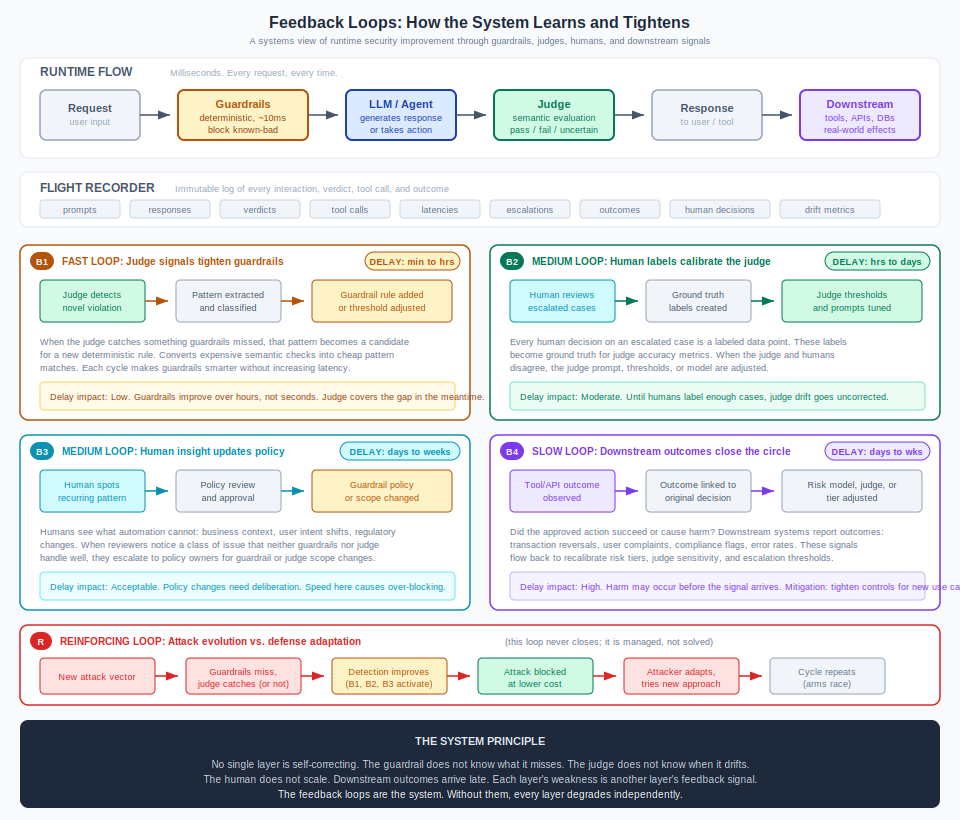

# The Feedback Loops That Make It Work

<!-- golden-thread-nav -->
!!! tip "Part of the Golden Thread (12 of 14)"
    Previous: [Infrastructure Beats Instructions](infrastructure-beats-instructions.md) · Next: [Architecture Overview](../ARCHITECTURE.md) · [See the full sequence](../reading-paths.md#the-golden-thread-guardrails-judges-and-why-they-work-together)
<!-- golden-thread-nav -->

*Guardrails prevent. Judges detect. Humans decide. But none of them improve on their own.*

A runtime security system with guardrails, a Model-as-Judge, and human oversight looks good on a diagram. Three layers, each catching what the others miss. Ship it.

But here is the question nobody asks at launch: how does it get better over time?

The answer is feedback loops. Four of them, operating at different speeds, each feeding information from one layer back into another. Without these loops, every layer degrades independently. Guardrails grow stale. The judge drifts. Humans drown in escalations. Downstream harm goes unnoticed until it becomes an incident.

This page maps those loops, explains why their timing matters, and shows how they combine into a system that tightens itself.

{ .arch-diagram }

## The four balancing loops

### B1: Judge signals tighten guardrails

**Speed: minutes to hours**

When the judge catches something the guardrails missed, that is a signal, not just a verdict. The detected pattern becomes a candidate for a new deterministic rule. A prompt injection variant the judge flagged semantically gets codified into a regex or classifier. A policy violation the judge caught through reasoning becomes a keyword or embedding match.

This is the cheapest feedback loop in the system. It converts expensive semantic evaluation (the judge spending tokens to reason about an output) into cheap pattern matching (the guardrail checking a rule in milliseconds). Each cycle makes the guardrail layer smarter without adding latency.

**Why the delay is acceptable:** The judge continues to cover the gap while the new rule is being written and tested. There is no unprotected window, just a period where detection costs more than it will later.

**How to use it:** Track "judge-only catches" as a metric. High numbers mean your guardrails have gaps. Feed the most frequent patterns into guardrail rule reviews on a weekly cadence.

### B2: Human labels calibrate the judge

**Speed: hours to days**

Every time a human reviews an escalated case and makes a decision, they produce a labeled data point. "The judge said uncertain. I say this is a clear violation." Or: "The judge flagged this, but it is actually fine."

These labels are ground truth. They feed into judge accuracy metrics: agreement rate, false positive rate, false negative rate. When the metrics drift below thresholds (agreement below 90% for HIGH-tier use cases, below 95% for CRITICAL), the judge needs recalibration. That means adjusting thresholds, refining the evaluation prompt, or retraining a distilled model.

**Why the delay matters:** Until humans label enough cases, judge drift goes undetected. If the judge starts missing a new class of violation, nobody knows until human reviewers flag the disagreement. This is why sampling rates matter: too low and you lack the label volume to detect drift quickly.

**How to use it:** Set minimum weekly label targets by risk tier. Track judge-vs-human agreement as a dashboard metric. When agreement drops, trigger a calibration review rather than waiting for the next scheduled one.

### B3: Human insight updates policy

**Speed: days to weeks**

Humans see what automation cannot. A reviewer notices that users in a specific region consistently trigger false positives because of cultural language differences. A compliance officer flags that a regulatory change means the AI can no longer recommend a class of product. A support lead identifies that the AI's tone has shifted in ways that are technically policy-compliant but practically harmful.

These are not cases where existing controls failed. They are cases where the controls need to change. The human escalates to policy owners, who update guardrail rules, judge evaluation criteria, or risk tier classifications.

**Why the delay is acceptable:** Policy changes need deliberation. A guardrail rule added hastily can cause more harm through over-blocking than the issue it was meant to prevent. The delay here is a feature: it forces review, testing, and sign-off before the system changes.

**How to use it:** Create a structured path from reviewer observations to policy change requests. Track "policy change suggestions" as a metric. If reviewers stop suggesting changes, either the system is perfect (unlikely) or the feedback path is broken.

### B4: Downstream outcomes close the circle

**Speed: days to weeks**

The three loops above are all internal. B4 is external. It asks: did the action the AI took actually work?

A customer service agent resolved a ticket. Did the customer come back with the same problem? A financial advisor recommended a portfolio adjustment. Did it perform as expected? An agent called an API. Did the API return an error, or did the downstream system flag the request as anomalous?

These outcome signals are the only way to validate that "pass" verdicts were truly correct. A judge can evaluate whether a response looks safe. Only downstream outcomes reveal whether it was actually safe.

**Why the delay is critical:** This is the most dangerous loop. Harm may have already occurred by the time the signal arrives. A bad recommendation that seemed reasonable takes weeks to prove harmful. A subtle data leak takes months to surface.

**Mitigation:** For new use cases or significant changes, tighten the other loops. Increase human sampling rates, lower judge thresholds, restrict guardrail exceptions. As downstream evidence accumulates and confirms safety, gradually relax.

## The reinforcing loop: the arms race

The four balancing loops above all work to close gaps. But there is a fifth dynamic that keeps opening them.

Attackers adapt. When a prompt injection pattern gets blocked, they try a different encoding. When the judge learns to catch a manipulation technique, they develop a new one. When guardrails tighten, they look for the seams between rules.

This is a reinforcing loop, not a balancing one. It does not converge on a stable state. It accelerates. The only sustainable response is to keep the balancing loops running faster than the reinforcing loop evolves. In practice, this means:

- **B1** must codify new patterns within hours, not weeks
- **B2** must detect judge drift within days, not months
- **B3** must update policy before regulatory deadlines, not after
- **B4** must surface downstream harm before it compounds

The system does not win the arms race. It manages it. The goal is to keep the cost of attack higher than the cost of defense.

## When feedback loops break

Each loop can fail in characteristic ways:

| Loop | Failure mode | Symptom | Fix |
|------|-------------|---------|-----|
| B1 | Judge catches are never reviewed for guardrail candidates | "Judge-only catch" rate stays flat or grows | Assign ownership for pattern review |
| B2 | Humans rubber-stamp escalations without careful labeling | Judge accuracy metrics look stable but are unreliable | Audit a sample of human labels for quality |
| B3 | Policy change suggestions go into a backlog and die | Reviewers stop suggesting changes | Set SLAs on policy change review |
| B4 | Downstream outcomes are not linked back to AI decisions | No way to know if "pass" verdicts were correct | Instrument outcome tracking from day one |

The most common failure is not a broken loop but a missing one. Teams build the runtime flow (guardrails, judge, human escalation) and never build the feedback paths. The system works on day one and degrades from day two.

## How to use feedback for tuning

Feedback is only useful if it reaches the right component in a form that component can use.

**Guardrails** accept rules, patterns, thresholds, and deny lists. Feed them structured outputs: regex patterns from judge catches, blocked-term lists from policy reviews, rate limits from anomaly detection.

**The judge** accepts prompt refinements, threshold adjustments, and retraining data. Feed it labeled examples from human review, edge cases from guardrail exceptions, and outcome data from downstream systems.

**Human reviewers** accept prioritized queues, context-rich case summaries, and decision guidelines. Feed them judge reasoning traces, similar past decisions, and outcome data for cases they reviewed previously.

**Risk tiers** accept reclassification based on accumulated evidence. A use case that starts at CRITICAL may move to HIGH after six months of clean outcomes. A use case at LOW may escalate after downstream signals reveal unexpected risk.

The tuning is not a one-time calibration. It is continuous. The diagram at the top of this page is not a project plan. It is a description of steady-state operations.

## The system principle

No single layer is self-correcting.

The guardrail does not know what it misses. The judge does not know when it drifts. The human does not scale. Downstream outcomes arrive late.

Each layer's weakness is another layer's feedback signal. The feedback loops are the system. Without them, every layer degrades independently. With them, each layer gets better because the others are watching.

!!! info "References"
    - [Why Your AI Guardrails Aren't Enough](../insights/why-guardrails-arent-enough.md)
    - [Judge Assurance](../core/judge-assurance.md)
    - [Temporal Decay](../insights/temporal-decay.md)
    - [The Flight Recorder Problem](../insights/the-flight-recorder-problem.md)
    - [PACE Resilience](../PACE-RESILIENCE.md)
    - [Humans Remain Accountable](../insights/humans-remain-accountable.md)
