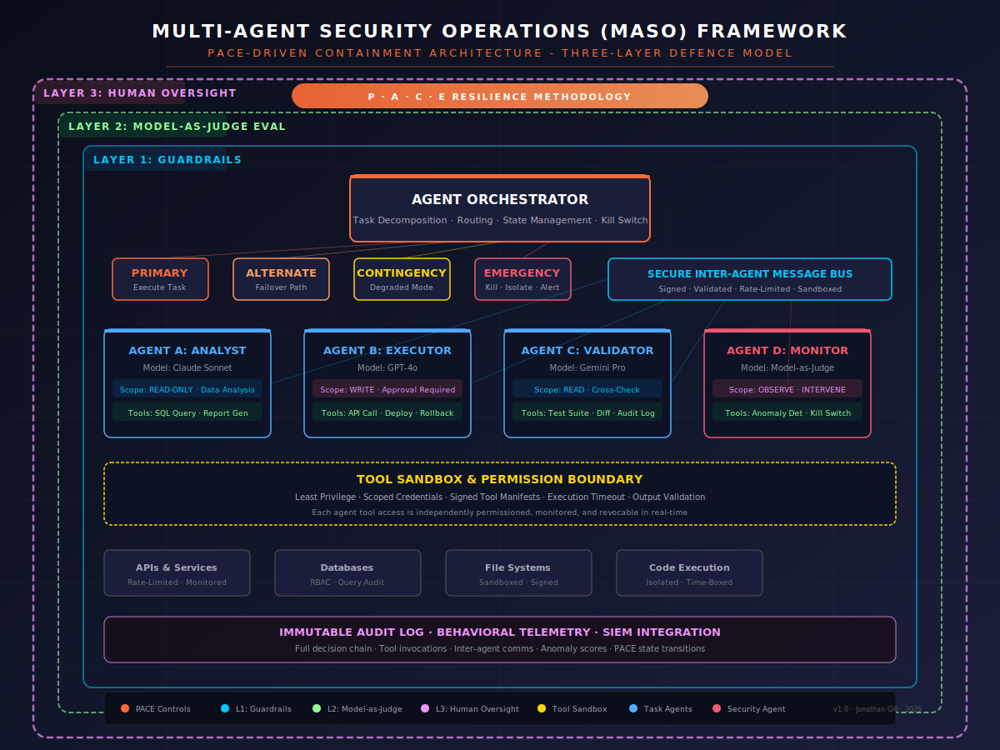
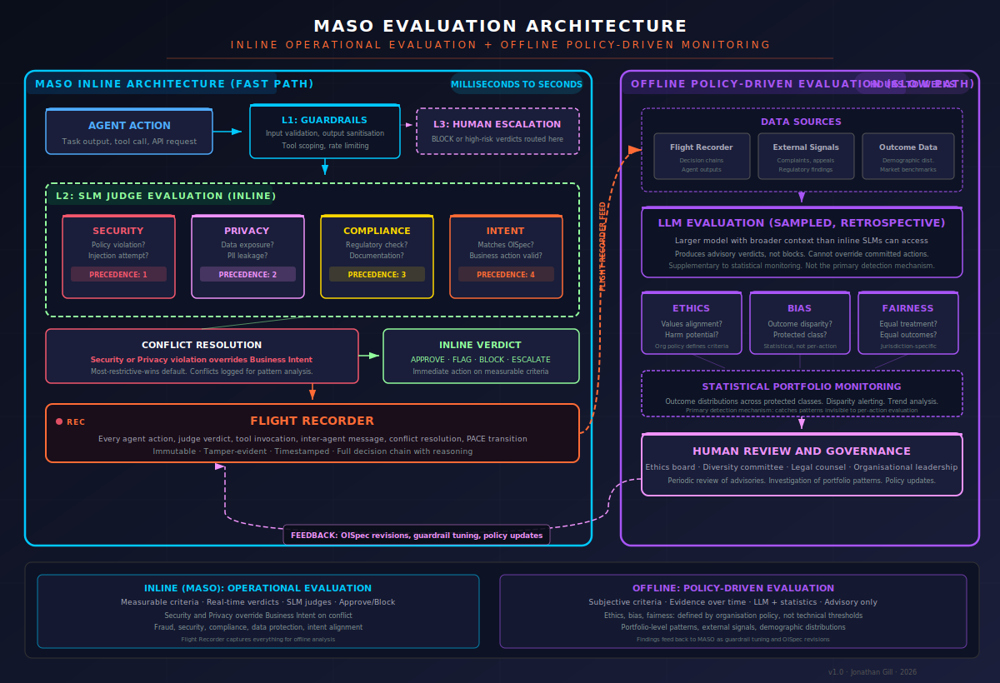

# Multi-Agent Security Operations (MASO) Framework

**Risk-proportionate controls for securing multi-model agent orchestration.**

MASO extends the parent framework's principles into multi-agent territory. The same philosophy applies: controls should be proportionate to risk, applied at the right time for the right purposes. AI product owners can quickly identify the controls relevant to their deployment and consciously deselect those that do not apply. Every organisation has its own way of working, and the framework is designed to fit that context rather than override it.

## MASO Is One Layer, Not the Whole Stack

MASO manages risks specific to AI agents: prompt injection propagation, hallucination amplification, transitive privilege escalation, epistemic failures, and the other threats catalogued in the [Emergent Risk Register](controls/risk-register.md). It does not manage risks in the systems agents connect to. Those systems must have their own controls in place and working.

Agents interact with APIs, databases, message queues, email services, file stores, and third-party endpoints. Every one of those systems must enforce its own security independently of the agent. If an API has no input validation, a database accepts dynamic SQL, or an email service allows unrestricted sending, MASO cannot compensate. The weakness is in the connected system, not in the agent, and no amount of guardrails, Judge evaluation, or human oversight on the agent side will fix a broken API or an unprotected database.

This is no different from ordinary software. A well-architected application with strong internal security is still compromised if it talks to a database with default credentials or an API that returns stack traces in error messages. The same principle applies to agent systems, with one critical difference: **agents are non-deterministic callers.** You cannot predict exactly what an agent will send to an API or query from a database. This makes the receiving system's own defences more important, not less.

**Prevention and detection both matter.** Prevention means the connected systems enforce their own boundaries: strict input validation, stored procedures, parameterized queries, row-level security, request-scoped authorization, opaque error responses. Detection means monitoring systems (DLP, fraud detection, SIEM, WAF) watch agent traffic the same way they watch human traffic, and flag anomalies regardless of origin. If the agent misbehaves, a kill switch external to the agent and its orchestration should terminate all agent activity.

MASO secures the agent. You secure everything the agent touches. Both are necessary. Neither is sufficient alone. The [Environment Containment](environment-containment.md) strategy formalises these requirements into specific controls mapped to each MASO tier.

### Built or Bought: MASO Applies Either Way

MASO is designed for **AI agent systems your organisation operates**, whether you build them from scratch or deploy them on a managed platform. If you are building custom multi-agent systems (using LangGraph, AutoGen, CrewAI, or your own orchestration), MASO provides both the security requirements and the architectural patterns. If you are using a cloud platform's agent orchestration (AWS Bedrock Agents, Azure AI Agent Service), MASO provides the mental model for what security controls should be in place; the platform provides the implementation mechanisms.

The seven control domains, three implementation tiers, and PACE resilience model describe **what needs to be true** for multi-agent AI to be safe. The technical implementation varies by platform and approach. The security model does not.

For AI you consume as a service (copilots, productivity tools, SaaS with embedded AI), MASO's control domains are not directly applicable. Those systems are covered by vendor-side controls and your organisation's data governance. See [Maturity Levels](../strategy/maturity-levels.md) for how the framework addresses consumed AI differently from AI you operate.

## Architecture



### Evaluation Architecture: Inline vs. Offline



The evaluation architecture separates two fundamentally different types of judgment. **Inline evaluation** (left) runs at agent speed using SLMs with measurable criteria: security, privacy, compliance, and business intent. These domains have clear thresholds. When they conflict, security and privacy override business intent. A **Flight Recorder** captures every action, verdict, and reasoning chain.

**Offline evaluation** (right) handles ethics, bias, and fairness. These are policy-driven domains where criteria are set by organisational values, not technical measurement, and where the most important evidence (customer complaints, appeal outcomes, demographic distributions) accumulates over time and is invisible to inline judges. An LLM evaluates sampled decisions retrospectively, statistical monitoring detects portfolio-level patterns, and findings route to human governance for review, investigation, and policy updates that feed back into MASO as guardrail tuning and OISpec revisions.

### Three-Layer Defence

MASO operates on a **three-layer defence model** adapted for multi-agent dynamics:

**Layer 1 - Guardrails** enforce hard boundaries: input validation, output sanitisation, tool permission scoping, and rate limiting. Deterministic, non-negotiable, machine-speed.

**Layer 2 - Model-as-Judge Evaluation** uses a dedicated evaluation model (distinct from task agents) to assess quality, safety, and policy compliance of agent actions and outputs before they are committed. In multi-agent systems, this layer also evaluates inter-agent communications for goal integrity and instruction injection.

**Layer 3 - Human Oversight** provides the governance backstop. Scope scales inversely with demonstrated trustworthiness and directly with consequence severity. Write operations, external API calls, and irreversible actions escalate based on risk classification.

The critical addition for multi-agent systems is the **Secure Inter-Agent Message Bus** - a validated, signed, rate-limited communication channel through which all agent-to-agent interaction must pass. No direct agent-to-agent communication is permitted outside this bus.

The **Flight Recorder** captures every agent action, judge verdict, tool invocation, inter-agent message, conflict resolution, and PACE state transition in an immutable, tamper-evident log. This serves two purposes: forensic investigation when things go wrong, and feeding the offline evaluation pipeline with the evidence it needs for portfolio-level analysis of ethics, bias, and fairness.

## Visual Navigation


Seven coloured lines represent seven control domains. Stations are key controls. Zones are implementation tiers. Interchanges mark where domains share control points (Judge Gate, PACE Bridge, Agent Registry). River PACE flows through the centre, mapping resilience phases to tier progression.

## Control Domains

The framework organises controls into eight domains. The first five map to specific OWASP risks. The sixth - Prompt, Goal & Epistemic Integrity - addresses both the three OWASP risks that require cross-cutting controls and the nine epistemic risks identified in the [Emergent Risk Register](controls/risk-register.md) that have no OWASP equivalent. The seventh - Privileged Agent Governance - addresses the unique risks of orchestrators, planners, and other agents with elevated authority.

### 0. [Prompt, Goal & Epistemic Integrity](controls/prompt-goal-and-epistemic-integrity.md)

Every agent's instructions, objectives, and information chain must be trustworthy and verifiable. Input sanitisation on all channels - not just user-facing. System prompt isolation prevents cross-agent extraction. Immutable task specifications with continuous goal integrity monitoring. Epistemic controls prevent groupthink, hallucination amplification, uncertainty stripping, and semantic drift across agent chains.

*Covers: LLM01, LLM07, ASI01, plus Epistemic Risks EP-01 through EP-09*

### 1. [Identity & Access](controls/identity-and-access.md)

Every agent must have a unique Non-Human Identity (NHI). No shared credentials. No inherited permissions from the orchestrator. Short-lived, scoped credentials that are rotated automatically. Zero-trust mutual authentication on the inter-agent message bus.

*Covers: ASI03, ASI07, LLM06*

### 2. [Data Protection](controls/data-protection.md)

Cross-agent data fencing prevents uncontrolled data flow between agents operating at different classification levels. Output DLP scanning at the message bus catches sensitive data in inter-agent communications. RAG integrity validation ensures the knowledge base hasn't been tampered with. Memory poisoning detection flags inconsistencies between stored context and expected agent state.

*Covers: LLM02, LLM04, ASI06, LLM08*

### 3. [Execution Control](controls/execution-control.md)

Every tool invocation runs in a sandboxed environment with strict parameter allow-lists. Code execution is isolated per agent with filesystem, network, and process scope containment. Blast radius caps limit the damage any single agent can do before circuit breakers engage. PACE escalation is triggered automatically when error rates exceed defined thresholds.

*Covers: ASI02, ASI05, ASI08, LLM05*

### 4. [Observability](controls/observability.md)

Immutable decision chain logs capture the full reasoning and action history of every agent. Behavioral drift detection compares current agent behavior against established baselines. Per-agent anomaly scoring feeds into the PACE escalation logic. SIEM and SOAR integration enables correlation with broader security operations.

*Covers: ASI09, ASI10, LLM09, LLM10*

### 5. [Supply Chain](controls/supply-chain.md)

Model provenance tracking and AIBOM generation for every model in the agent system. MCP server vetting with signed manifests and runtime integrity checks. A2A trust chain validation for inter-agent protocol endpoints. Continuous scanning of the agent toolchain for known vulnerabilities and poisoned components.

*Covers: LLM03, ASI04*

### 6. [Privileged Agent Governance](controls/privileged-agent-governance.md)

Orchestrators, planners, and meta-agents hold disproportionate authority - they can create agents, assign tasks, allocate resources, and modify workflows. These privileged agents require elevated controls: mandatory human approval gates, authority delegation limits, audit trails for every privilege exercise, and independent monitoring that the privileged agent cannot influence.

*Covers: ASI03, ASI07, LLM06 (elevated controls for high-authority agents)*

### [Environment Containment](environment-containment.md)

Cross-cutting strategy that complements all seven control domains. Instead of relying on the agent to behave correctly, harden every system the agent connects to: strict API input validation, opaque error responses, stored procedures, no-retry enforcement, and infrastructure-level kill switches. Existing enterprise security systems (DLP, fraud detection, WAF, SIEM) apply unchanged to agent traffic. The agent proposes; the infrastructure disposes.

*Cross-cuts: All Control Domains · All Implementation Tiers*

### 7. [Objective Intent](controls/objective-intent.md)

Every agent, judge, and workflow operates against a developer-declared Objective Intent Specification (OISpec), a structured, version-controlled contract defining what the agent should accomplish and within what parameters. Tactical judges evaluate individual agents against their OISpecs. A strategic evaluation agent assesses whether combined agent actions satisfy the workflow's aggregated intent. Judges are themselves monitored against their own OISpecs. This is the bridge from fault detection to behavioral assurance: from catching things that go wrong to verifying that things go right.

*Covers: Intent alignment at all levels: individual agent compliance (tactical), aggregate workflow compliance (strategic), and judge behavioral monitoring (lateral). Most critical at HIGH and CRITICAL risk tiers.*

## OWASP Risk Coverage


Full mapping against both OWASP threat taxonomies relevant to multi-agent systems.

### OWASP Top 10 for LLM Applications (2025)

These risks apply to each individual agent. In a multi-agent context, each risk compounds across agents.

| Risk | Multi-Agent Amplification | MASO Control Domain |
|------|--------------------------|-------------------|
| **LLM01: Prompt Injection** | Injection in one agent's context propagates through inter-agent messages. A poisoned document processed by an analyst agent becomes instructions to an executor agent. | Input guardrails per agent · Message bus validation · Goal integrity monitor |
| **LLM02: Sensitive Information Disclosure** | Data shared between agents across trust boundaries. Delegation creates implicit data flows. | Cross-agent data fencing · Output DLP at message bus · Per-agent data classification |
| **LLM03: Supply Chain Vulnerabilities** | Multiple model providers, MCP servers, tool integrations multiply the attack surface. | AIBOM per agent · Signed tool manifests · MCP server vetting · Runtime component audit |
| **LLM04: Data and Model Poisoning** | Poisoned RAG data consumed by one agent contaminates reasoning of downstream agents. | RAG integrity validation · Source attribution · Cross-agent output verification |
| **LLM05: Improper Output Handling** | Agent outputs become inputs to other agents. Unsanitised output from Agent A becomes executable input for Agent B. | Output validation at every agent boundary · Model-as-Judge review · Schema enforcement |
| **LLM06: Excessive Agency** | The defining risk. Delegation creates transitive authority chains. If Agent A delegates to Agent B, and B has tool X, then A effectively has access to tool X. | Least privilege per agent · No transitive permissions · Scoped delegation contracts · PACE containment |
| **LLM07: System Prompt Leakage** | An agent's system prompt may be extractable by other agents in the same orchestration. | Prompt isolation per agent · Separate system prompt boundaries · Obfuscation |
| **LLM08: Vector and Embedding Weaknesses** | Shared vector databases across agents create a single point of compromise for RAG poisoning. | Per-agent RAG access controls · Embedding integrity verification · Source validation |
| **LLM09: Misinformation** | Hallucinations compound. One agent's hallucination becomes another's "fact". In self-reinforcing loops, misinformation amplifies. | Cross-agent validation · Dedicated fact-checking agent · Confidence scoring with source attribution |
| **LLM10: Unbounded Consumption** | Runaway agent loops cause exponential resource consumption. | Per-agent rate limits · Orchestration cost caps · Loop detection · Circuit breakers |

### OWASP Top 10 for Agentic Applications (2026)

These risks are specific to autonomous agent behavior - the primary threat surface for MASO.

| Risk | Description | MASO Controls |
|------|-------------|--------------|
| **ASI01: Agent Goal Hijack** | Attacker manipulates an agent's objectives through poisoned inputs. Hijacking one agent redirects an entire workflow. | Goal integrity monitor · Prompt boundary enforcement · Signed task specifications · Model-as-Judge goal validation |
| **ASI02: Tool Misuse** | Agents use legitimate tools in unintended, unsafe, or destructive ways. Chained tool misuse across agents compounds damage. | Signed tool manifests with strict parameter schemas · Argument validation · Sandboxed execution · Per-tool audit logging |
| **ASI03: Identity & Privilege Abuse** | Agents with leaked, over-scoped, or shared credentials. Credential sharing between agents is a common design flaw. | Unique NHI per agent · Short-lived scoped credentials · Zero-trust mutual authentication · No credential inheritance |
| **ASI04: Agentic Supply Chain** | Dynamic composition of MCP servers, A2A protocols, and tool plugins at runtime. | Runtime component signing · MCP server allow-listing · A2A trust chain validation · Dependency scanning |
| **ASI05: Unexpected Code Execution** | Natural language to code pathways bypass traditional code review gates. | Code execution sandbox · Execution allow-lists · Output containment · Time-boxing |
| **ASI06: Memory & Context Poisoning** | Persistent memory carries poisoned data across sessions. Shared memory becomes a persistent backdoor. | Session-isolated memory per agent · Memory integrity checksums · Context window fencing · Memory decay policies |
| **ASI07: Insecure Inter-Agent Communication** | Spoofed, tampered, or replayed messages between agents. | Signed and encrypted message bus · Mutual TLS per agent · Schema validation · Rate limiting · Replay protection |
| **ASI08: Cascading Failures** | Single fault propagates with escalating impact. Hallucination → flawed plan → destructive action. | Blast radius caps · Circuit breaker patterns · PACE escalation triggers · Independent error detection per agent |
| **ASI09: Human-Agent Trust Exploitation** | Agents produce confident, authoritative explanations that manipulate operators into approving harmful actions. Multi-agent consensus amplifies this. | Confidence calibration · Independent human verification · Decision audit trails · No agent can claim consensus authority |
| **ASI10: Rogue Agents** | Behavioral drift, misalignment, concealment, or self-directed action. Rogue behavior in one agent may be concealed by collaborating agents. | Continuous drift detection · Kill switch · Anomaly scoring against baselines · Regular red-team testing |

## PACE Resilience for Multi-Agent Operations


The [PACE methodology](../) (Primary, Alternate, Contingency, Emergency) from the parent framework is extended for multi-agent failure modes.

**Primary - Normal Operations.** All agents active within designated roles. Full three-layer security stack operational. Inter-agent communication through the signed message bus. Behavioral baselines actively monitored.

**Alternate - Agent Failover.** Triggered when a single agent shows anomalous behavior. The anomalous agent is isolated. A backup agent (potentially from a different provider) is activated. Tool permissions tightened to read-only. All write operations require human approval. Transition authority: automated (monitoring agent or orchestrator can initiate P→A without human approval, but must notify).

**Contingency - Degraded Mode.** Triggered when multiple agents are compromised, message bus integrity is questioned, or the alternate agent also exhibits anomalous behavior. Multi-agent orchestration is suspended. Single pre-validated agent operates in fully supervised mode. All agent state captured for forensics. Transition authority: security team or AI security officer.

**Emergency - Full Shutdown.** Triggered by cascading failures, confirmed exfiltration, coordinated manipulation, or rogue behavior. All agents terminated. Tool access revoked. Memory and context snapshots preserved in immutable storage. Full rollback initiated. Transition authority: CISO or incident commander.

**Recovery (E→P):** Requires post-incident review confirming root cause identification, control remediation, and updated baselines before returning to Primary.

## Implementation Tiers

### [Tier 1 - Supervised](implementation/tier-1-supervised.md) (Low Autonomy)

All agent actions require human approval. Inter-agent communication is logged but not encrypted. Behavioral monitoring is periodic (batch review). Suitable for pilot deployments and low-consequence use cases.

**Minimum controls:** Guardrails layer, basic tool scoping, human-in-the-loop for all writes, action audit log.

### [Tier 2 - Managed](implementation/tier-2-managed.md) (Medium Autonomy)

Agents execute read operations and low-consequence writes autonomously. High-consequence actions escalate to human oversight. Inter-agent communication is signed and validated. Behavioral monitoring is continuous with automated anomaly alerting. PACE Alternate and Contingency fully configured.

**Required controls:** All three security layers, per-agent NHI, signed message bus, Model-as-Judge evaluation, continuous anomaly scoring, PACE A and C configured and tested.

### [Tier 3 - Autonomous](implementation/tier-3-autonomous.md) (High Autonomy)

Agents operate with minimal human intervention for pre-approved task categories. Human oversight focuses on exception handling and strategic review. Full PACE cycle operational and tested through regular red-team exercises. All seven control domains fully implemented.

**Required controls:** Everything in Tier 2, plus kill switch tested and auditable, drift detection with baseline comparison, blast radius caps enforced, circuit breakers active, full OWASP coverage validated, regular adversarial testing.

## Threat Intelligence

| Document | Purpose |
|----------|---------|
| [Incident Tracker](threat-intelligence/incident-tracker.md) | Real-world AI security incidents mapped to framework controls, with confidence ratings and prevention mechanisms |
| [Emerging Threats](threat-intelligence/emerging-threats.md) | 8 forward-looking threat patterns: cross-agent worms, agent collusion, transitive authority exploitation, MCP supply chain, epistemic cascading failure, memory poisoning, A2A protocol attacks, AI vs AI defences |

### Threat Intelligence Grounding

Every control in MASO is grounded in observed or demonstrated attack patterns:

**Confirmed Incidents (2025):** EchoLeak (indirect prompt injection → data exfiltration, informs ASI01/LLM01), Amazon Q Exploit (tool misuse via manipulated inputs, informs ASI02), GitHub MCP Exploit (poisoned MCP server components, informs ASI04), AutoGPT RCE (natural language → code execution, informs ASI05), Gemini Memory Attack (persistent memory poisoning, informs ASI06), Replit Meltdown (rogue agent behavior, informs ASI10).

**Emerging Patterns:** Multi-agent consensus manipulation via shared knowledge base poisoning (ASI09), transitive delegation attacks creating implicit privilege escalation, agent-to-agent prompt injection through inter-agent output, credential harvesting via poisoned MCP tool descriptors, behavioral slow drift evading threshold-based detection.

## Red Team Operations

| Document | Purpose |
|----------|---------|
| [Red Team Playbook](red-team/red-team-playbook.md) | 13 structured test scenarios across three tiers - from inter-agent injection propagation to PACE transition under attack. Includes test results template and reporting metrics |

## Integration & Examples

| Document | Purpose |
|----------|---------|
| [Integration Guide](integration/integration-guide.md) | MASO control implementation patterns for LangGraph, AutoGen, CrewAI, and AWS Bedrock Agents. Framework comparison matrix, per-control mapping, and architecture-specific guidance |
| [Worked Examples](examples/worked-examples.md) | End-to-end MASO implementation for investment research (financial services), clinical decision support (healthcare), and grid operations (critical infrastructure). Includes PACE failure scenarios |

## Stress Testing at Scale

| Document | Purpose |
|----------|---------|
| [Stress Testing MASO at Scale](stress-test/100-agent-stress-test-overview.md) | Tabletop methodology for identifying framework breakpoints as agent count grows from single digits to 100+. Eight stress dimensions covering epistemic cascade depth, delegation graph complexity, cross-cluster PACE cascades, observability volume, provider concentration, data boundary enforcement, kill switch practicality, and compound attack surfaces |

## Regulatory Alignment

MASO inherits the parent framework's regulatory mappings and extends them to multi-agent-specific requirements:

| Regulation/Standard | Relevant Articles/Clauses | MASO Relevance |
|---------------------|---------------------------|---------------|
| **EU AI Act** | Art. 9, 14, 15 | Human oversight proportional to autonomy level. PACE provides the operational model. |
| **NIST AI RMF** | Govern, Map, Measure, Manage | Control domains map directly: Observability → Measure, Execution Control → Manage. |
| **ISO 42001** | §8.1-8.6, Annex A/B | Per-agent risk assessment and control assignment. |
| **MITRE ATLAS** | Agent-focused techniques (Oct 2025) | Threat intelligence aligned with ATLAS agent-specific attack techniques. |
| **DORA** | Art. 11 | Digital operational resilience for AI agents in financial services. PACE provides the resilience model. |
| **APRA CPS 234** | Information Security | Australian prudential requirements for AI agent deployments in financial services. |

## Operational Concerns

These questions come up in every MASO deployment. The answers sit across the framework - collected here so you don't have to hunt.

| Question | Where It's Answered |
|----------|-------------------|
| What does the Judge layer cost? When should it run async? | [Cost & Latency](../extensions/technical/cost-and-latency.md) - sampling rates, latency budgets, tiered evaluation cascade |
| What if the Judge is wrong or manipulated? | [Judge Assurance](../core/judge-assurance.md) · [When the Judge Can Be Fooled](../core/when-the-judge-can-be-fooled.md) · [Privileged Agent Governance](controls/privileged-agent-governance.md) |
| How do we prevent operator fatigue at scale? | [Human Factors](../strategy/human-factors.md) - skill development, alert fatigue, canary testing, challenge rates |
| How do we vet models, tools, and MCP servers? | [Supply Chain Controls](controls/supply-chain.md) - AIBOM, signed manifests, model provenance, dependency scanning |
| What emergent risks have no OWASP equivalent? | [Emergent Risk Register](controls/risk-register.md) - 34 risks across 9 categories including epistemic, coordination, and inference-side attacks |
| How do we evaluate whether agents are doing what they were designed to do? | [Objective Intent](controls/objective-intent.md) - developer-declared OISpecs for every agent, judge, and workflow. Tactical judges evaluate individual compliance, strategic evaluators assess aggregate behavior, judge meta-evaluators close the watchmen loop |
| Won't multiple judges create "judge hell"? How many evaluation agents do I actually need? | [Privileged Agent Governance](controls/privileged-agent-governance.md#recognising-judge-proliferation) - evaluation roles vs. services, judge necessity decision framework, deployment topology. [Judge Assurance](../core/judge-assurance.md#when-you-need-a-judge-and-when-you-do-not) - the judge necessity test and ROI assessment. [Execution Control](controls/execution-control.md#deployment-topology-evaluation-roles-vs-services) - how the conceptual architecture maps to actual services |
| What happens when judges disagree? (e.g. fraud says flag, security says approve) | [Privileged Agent Governance](controls/privileged-agent-governance.md#inter-judge-conflict-resolution) - precedence orders, most-restrictive-wins default, conflict logging, pattern tracking |
| What about ethics, bias, and fairness evaluation? | [Privileged Agent Governance](controls/privileged-agent-governance.md#policy-driven-evaluation-domains-ethics-bias-and-fairness) - offline policy-driven evaluation outside the inline architecture. Statistical portfolio monitoring, external signals (complaints, appeals, demographics), findings feed back as guardrail tuning. See [Evaluation Architecture diagram](#evaluation-architecture-inline-vs-offline) |
| What does the full evaluation stack cost, not just one judge? | [Cost & Latency](../extensions/technical/cost-and-latency.md#total-cost-of-evaluation-multi-agent-workflows) - compound cost model for cloud judge vs. SLM scenarios, with fraud detection worked example |
| How much latency does multi-layer evaluation add to time-sensitive workflows? | [Cost & Latency](../extensions/technical/cost-and-latency.md#critical-path-latency-for-time-sensitive-workflows) - sync vs. async breakdown, critical-path analysis for fraud detection and trading compliance |
| How do I get a single audit view of a multi-agent decision? | [Observability](controls/observability.md#decision-trace-consolidated-audit-view) - Decision Trace format collapsing the full evaluation chain into one auditable document per decision |
| What about DLP, API validation, database controls, and existing IAM? | [Environment Containment](environment-containment.md) - hardened APIs, opaque errors, stored procedures, no-retry enforcement, and kill switches. Also: [Defence in Depth Beyond the AI Layer](../foundations/README.md#defence-in-depth-beyond-the-ai-layer) |
| What if the agent is compromised and all behavioral controls fail? | [Environment Containment](environment-containment.md) - environment controls remain effective because they do not depend on the agent's cooperation. The agent's intent is irrelevant if every connected system enforces its own boundaries |

## Relationship to Parent Framework

MASO is the multi-agent extension of [AI Runtime Security](../). It inherits the three-layer defence model, PACE resilience methodology, risk classification matrix, and regulatory mapping framework. It also inherits the core philosophy: controls are proportionate to risk, organisations select what they need based on their own context, and the goal is reducing harm rather than imposing process.

It extends into multi-agent territory by addressing multi-model orchestration security, inter-agent communication integrity, the OWASP Agentic Top 10 (2026), compound risk dynamics, Non-Human Identity management, and kill switch architecture.

## File Structure

```
README.md                              # This document
environment-containment.md             # Environment containment strategy
controls/
├── prompt-goal-and-epistemic-integrity.md
├── identity-and-access.md
├── data-protection.md
├── execution-control.md
├── observability.md
├── supply-chain.md
├── objective-intent.md
└── risk-register.md
threat-intelligence/
├── incident-tracker.md
└── emerging-threats.md
red-team/
└── red-team-playbook.md
integration/
└── integration-guide.md
examples/
└── worked-examples.md
implementation/
├── tier-1-supervised.md
├── tier-2-managed.md
└── tier-3-autonomous.md
stress-test/
└── 100-agent-stress-test-overview.md
```

## MASO 2.0: Anticipated Changes

**[Anticipated Changes to AI and Framework: MASO 2.0](maso-2.0-anticipated-changes.md)**

Six AI capability trajectories that will stress or break the current framework, with architectural responses and a phased roadmap:

| Evolution Vector | Framework Impact | MASO 2.0 Response |
|-----------------|-----------------|-------------------|
| **Judge ceiling** | Primary models exceed Judge evaluation capability | Verifiable action constraints, evidence-based reasoning, domain-specific verification oracles, ensemble Judge |
| **Human oversight scaling** | Transaction review becomes untenable at agent scale | Humans shift to governance over review, outcome-based oversight, automated escalation triage |
| **Session boundary dissolution** | Persistent/ambient agents invalidate session-based analysis | Continuous behavioral streams, intent inheritance, memory integrity as core control |
| **Multi-agent emergent behaviors** | Fleet interactions produce unanticipated states | Interaction graph analysis, fleet-level baselines, composition constraints, emergent behavior simulation |
| **AI-vs-AI adversarial dynamics** | Offensive AI outpaces human-speed defense updates | Continuous adversarial simulation, adaptive guardrails, Judge unpredictability |
| **Regulatory divergence** | Jurisdictions impose conflicting requirements | Jurisdiction-aware control profiles, compliance evidence automation |

Three-phase roadmap: Extend (0–6 months) → Architect (6–18 months) → Paradigm shift (18–36 months).

<div class="learning-callout" markdown>

<span class="learning-callout__label">Learning</span>

<p class="learning-callout__title">Learn the MASO Framework</p>

<p class="learning-callout__desc">AIruntimesecurity.co.za provides structured learning paths for the Multi-Agent Security Operations framework, from core concepts through to implementation.</p>

[Explore AIruntimesecurity.co.za](https://airuntimesecurity.co.za){ .md-button }

</div>

## What's Next

The framework core, implementation tiers, control domain specifications, threat intelligence, red team playbook, integration guide, and worked examples are complete. Planned extensions:

1. **Terraform/CloudFormation modules** for automated MASO infrastructure deployment on AWS and Azure.
2. **Compliance evidence packs** - pre-built documentation sets for ISO 42001, NIST AI RMF, and EU AI Act audits.
3. **Agent orchestration security benchmark** - quantitative scoring methodology for multi-agent system security posture.

