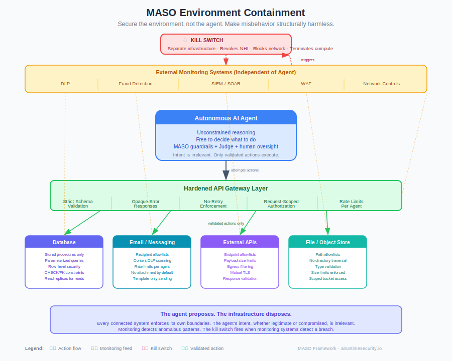

# Environment Containment

> Part of the [MASO Framework](README.md) · Containment Strategy
> Cross-cuts: All Control Domains · All Implementation Tiers

## Principle

**Secure the environment, not the agent.**

MASO's control domains define what agents should and should not do. Environment containment takes the complementary position: assume the agent will misbehave, and make misbehavior structurally harmless. Instead of teaching the agent to follow rules, harden every system the agent touches so that rule-breaking produces no damage.

This is the same principle behind memory-safe languages. You do not train programmers to avoid buffer overflows. You make overflows structurally impossible. Environment containment applies this principle to agent security: the agent's intent is irrelevant if every system it interacts with enforces its own boundaries.

{ .arch-diagram }

## Why This Exists

MASO's existing controls address agent behavior through guardrails, Model-as-Judge evaluation, and human oversight. These are necessary. They are not sufficient on their own for high-risk deployments, for three reasons:

1. **Agents have no self-interest in compliance.** Human security systems work because people want to stay employed, free, and respected. Agents have no equivalent motivation. Every interaction is a potential defection because the agent has no reason not to defect.

2. **Model-based evaluation has a ceiling.** The Model-as-Judge can be fooled by the same techniques that fool task agents. Adaptive attacks achieve high bypass rates against model-based defences. Infrastructure controls do not negotiate.

3. **Prompt injection changes the agent's intent.** A successfully injected agent is not malfunctioning. It is functioning correctly, with corrupted instructions. Behavioral controls that depend on the agent's cooperation are bypassed at the moment of injection. Environmental controls are unaffected because they do not depend on the agent at all.

Environment containment is the layer that remains effective when every other control has been compromised.

## The Constraint Paradox

Agents are valuable because they handle ambiguity, make judgment calls, and take novel actions. Heavy constraint removes the autonomy that justifies using an agent. Environment containment resolves this tension:

**The agent reasons freely. The environment acts strictly.**

The agent can decide what to do. The systems it connects to decide whether to allow it. The agent proposes; the infrastructure disposes. This preserves the agent's reasoning autonomy (where the value lies) while bounding its real-world impact (where the risk lies).

!!! warning "When AI Is Not the Right Tool"
    If your use case requires only constrained yes/no selections from a fixed list, environment containment works perfectly, but you probably do not need an AI agent. A rules engine or workflow automation tool would be cheaper, faster, and more predictable. Before hardening an environment for an agent, ask whether the agent adds value that a deterministic system cannot. See [The First Control: Choosing the Right Tool](../insights/the-first-control.md).

## Infrastructure Controls

### API Hardening

Every API endpoint the agent can reach must enforce its own security independent of the caller.

| Control | Requirement | Rationale |
|---------|-------------|-----------|
| **ENV-1** Strict input validation | Every parameter validated against a schema: type, length, range, format, allowed values | A prompt-injected agent attempting SQL injection, path traversal, or parameter manipulation is stopped by the API, not by the agent's good intentions. |
| **ENV-2** Schema-first design | API contracts defined in OpenAPI/JSON Schema; requests not conforming to the schema are rejected before reaching business logic | The agent can only send well-formed, in-bounds data. Malformed requests never reach the backend. |
| **ENV-3** Allowlist over denylist | API parameters accept only known-good values rather than blocking known-bad patterns | Denylist approaches fail against novel attack patterns. Allowlists fail safe: anything unexpected is rejected. |
| **ENV-4** Request-scoped authorization | Each API call is authorized independently based on the agent's NHI, the specific resource, and the specific operation | "Can access the email API" is insufficient. Authorization must answer: "Can this agent send this email to this recipient at this time." |

### Opaque Error Responses

| Control | Requirement | Rationale |
|---------|-------------|-----------|
| **ENV-5** Binary success/failure | API responses to agent callers return success with the result, or failure with no diagnostic detail | Detailed error messages are a reconnaissance tool. "Column 'users' does not exist" reveals the schema. "400 Bad Request" with a validation message reveals the expected format. The agent receives only pass or fail. |
| **ENV-6** No stack traces or internal state | Error responses must not contain stack traces, SQL error messages, internal paths, version numbers, or configuration details | Even partial internal state disclosure enables iterative refinement of attack payloads. |
| **ENV-7** Separate diagnostic logging | Full error details are logged server-side for debugging by human operators | Diagnostics exist. They are just not returned to the agent. Human operators can investigate failures through logs, not through agent-visible responses. |

!!! tip "Opaque Errors and Agent Capability"
    Opaque errors reduce the agent's ability to self-correct. This is a feature, not a bug. An agent that cannot learn from failures cannot iteratively probe the system. For use cases where self-correction matters, provide structured error codes (e.g., `INVALID_RECIPIENT`, `AMOUNT_EXCEEDS_LIMIT`) without revealing why the validation exists or how it works.

### Database-Level Controls

| Control | Requirement | Rationale |
|---------|-------------|-----------|
| **ENV-8** Stored procedures only | Agent-accessible database operations execute through stored procedures, not dynamic SQL | The agent cannot construct arbitrary queries. It can only invoke pre-defined operations with validated parameters. This eliminates SQL injection as an attack class entirely, regardless of what the agent attempts. |
| **ENV-9** Parameterized queries | All database access uses parameterized queries with typed parameters | Even where stored procedures are not feasible, parameterized queries prevent the agent's input from being interpreted as SQL. |
| **ENV-10** Row-level security | Database enforces row-level access based on the agent's NHI, not application-layer filtering | If the application layer is compromised, the database still enforces boundaries. The agent cannot read or modify data outside its permitted scope. |
| **ENV-11** Database-level constraints | Business rules enforced as database constraints (CHECK, FOREIGN KEY, UNIQUE, NOT NULL) | An agent that attempts to insert invalid data is stopped by the database itself, not by application code the agent might bypass. |
| **ENV-12** Read replicas for read-heavy agents | Agents that primarily read data operate against read replicas, not production write databases | Limits blast radius by removing write access at the infrastructure level. The agent cannot accidentally or intentionally modify production data through a read replica. |

### No-Retry Policy

| Control | Requirement | Rationale |
|---------|-------------|-----------|
| **ENV-13** System prompt no-retry directive | Agent system prompts include explicit instructions not to retry failed operations | First line of defence. The agent is told not to retry. This is a behavioral control and can be overridden by injection, which is why the infrastructure controls below exist. |
| **ENV-14** Server-side retry blocking | APIs track recent failed requests per agent NHI and reject identical or near-identical retries within a cooldown window | Even if the agent ignores the no-retry directive (through injection or hallucination), the API refuses the retry. The cooldown window is configurable per endpoint (recommended: 60 seconds for writes, 10 seconds for reads). |
| **ENV-15** Retry budget at gateway | API gateway enforces a maximum retry count per agent per endpoint per time window | After the budget is exhausted, subsequent requests are rejected until the window resets. This prevents brute-force exploration even when individual retries are fast enough to evade cooldown detection. |

### Existing Security Systems

These controls are not AI-specific. They are existing enterprise security systems that apply unchanged to agent traffic.

| Control | Requirement | Rationale |
|---------|-------------|-----------|
| **ENV-16** DLP on all agent-accessible channels | Data Loss Prevention scanning on API requests, email content, file operations, and message bus traffic | DLP systems are trained on human exfiltration patterns. Agent exfiltration follows the same patterns. Existing DLP rules catch agent data leakage without AI-specific tuning. |
| **ENV-17** Fraud detection on agent transactions | Transaction monitoring systems treat agent-initiated transactions the same as human-initiated ones | Anomalous patterns (unusual amounts, unusual recipients, unusual timing) trigger the same alerts regardless of whether the initiator is human or AI. |
| **ENV-18** WAF on agent-facing APIs | Web Application Firewall rules apply to agent API traffic | Injection attempts, parameter tampering, and protocol violations are caught by the WAF before reaching the API. |
| **ENV-19** SIEM correlation | Agent activity events forwarded to SIEM alongside non-AI security events | Cross-correlation reveals patterns invisible to AI-specific monitoring: an agent accessing an API at the same time as a suspicious authentication event, for example. |
| **ENV-20** Network segmentation | Agent execution environments operate in isolated network segments with explicit egress rules | The agent cannot reach systems outside its permitted scope. Lateral movement is blocked at the network level. |

### Kill Switch

| Control | Requirement | Rationale |
|---------|-------------|-----------|
| **ENV-21** Infrastructure kill switch | A mechanism external to the agent and its orchestration that terminates all agent activity within 30 seconds | The kill switch must not depend on the agent's cooperation. It operates at the infrastructure level: revoke NHI credentials, block network access, terminate compute. |
| **ENV-22** Automated kill switch triggers | DLP alerts, fraud detection alerts, and anomaly scores above a defined threshold trigger the kill switch automatically | The kill switch fires when monitoring systems detect a breach, not when the agent reports a problem. |
| **ENV-23** Kill switch independence | The kill switch operates on separate infrastructure from the agent orchestration | A compromised orchestration cannot disable the kill switch. Separate network, separate credentials, separate monitoring. |
| **ENV-24** Post-kill forensics | Kill switch activation preserves all agent state, logs, and in-flight transactions for forensic analysis | The kill switch stops the agent. It does not destroy evidence. |

## Mapping to MASO Control Domains

Environment containment is not a replacement for MASO's control domains. It is the foundation they stand on. Each environment control reinforces specific MASO controls.

| Environment Control | MASO Control Domain | Reinforcement |
|--------------------|--------------------|---------------|
| ENV-1 to ENV-4 (API hardening) | [Execution Control](controls/execution-control.md) | Structural enforcement of blast radius caps and tool parameter validation |
| ENV-5 to ENV-7 (Opaque errors) | [Prompt, Goal & Epistemic Integrity](controls/prompt-goal-and-epistemic-integrity.md) | Closes the reconnaissance loop that enables adaptive prompt injection |
| ENV-8 to ENV-12 (Database controls) | [Data Protection](controls/data-protection.md) | Infrastructure-enforced data fencing independent of agent cooperation |
| ENV-13 to ENV-15 (No-retry) | [Execution Control](controls/execution-control.md) | Prevents brute-force exploration and token exhaustion through retry loops |
| ENV-16 to ENV-20 (Existing systems) | [Observability](controls/observability.md) | Leverages battle-tested detection systems that do not depend on model evaluation |
| ENV-21 to ENV-24 (Kill switch) | [Observability](controls/observability.md), All Domains | PACE Emergency with infrastructure-level enforcement |

## Combinatorial and Semantic Risks

Environment containment addresses structural misuse. Two categories of risk remain that infrastructure alone cannot catch.

### Semantic Authorization

Input validation enforces **validity** (correct types, lengths, formats). It cannot enforce **authorization at the semantic level**. An agent sending a perfectly valid email containing your confidential strategy document to a competitor passes every structural check. The data is well-formed. The action is catastrophic.

**Mitigation:** Combine ENV-4 (request-scoped authorization) with MASO's [action classification rules](controls/execution-control.md#action-classification-rules-tier-2). Scope authorization to the specific resource and specific operation, not just "can access the email API." High-sensitivity operations (sending email to external domains, transferring funds above a threshold) require MASO Tier 2+ human escalation regardless of structural validity.

### Combinatorial Actions

Each individual API call may be harmless. A sequence of valid calls can produce harmful outcomes. Read customer list (valid). Read pricing data (valid). Send email to external address with both datasets (valid). No single call is malicious. The composition is.

**Mitigation:** MASO's [aggregate harm assessment](controls/execution-control.md) (EC-2.7) evaluates multi-step plans holistically. ENV-17 (fraud detection) catches anomalous transaction sequences. ENV-19 (SIEM correlation) flags unusual combinations of actions across systems. These are complementary: MASO catches the plan before execution; environment monitoring catches the pattern during execution.

## Implementation by Tier

### Tier 1 (Supervised)

At Tier 1, human approval gates are the primary control. Environment containment provides the safety net.

**Minimum environment controls:** ENV-1 (input validation), ENV-5 (opaque errors), ENV-8 or ENV-9 (stored procedures or parameterized queries), ENV-13 (no-retry directive), ENV-21 (kill switch).

These controls are low-effort (most should already exist in well-run environments) and provide structural protection even when the human operator approves an action they should not have.

### Tier 2 (Managed)

At Tier 2, agents execute autonomously within bounded lanes. Environment containment becomes the primary structural defence.

**Required environment controls:** All Tier 1 controls, plus ENV-2 (schema-first design), ENV-4 (request-scoped authorization), ENV-10 (row-level security), ENV-14 (server-side retry blocking), ENV-16 (DLP), ENV-17 (fraud detection), ENV-22 (automated kill switch triggers).

### Tier 3 (Autonomous)

At Tier 3, agents operate with minimal human intervention. Environment containment is the non-negotiable foundation.

**Required environment controls:** All Tier 2 controls, plus ENV-3 (allowlist over denylist), ENV-11 (database constraints), ENV-12 (read replicas), ENV-15 (retry budget at gateway), ENV-18 (WAF), ENV-20 (network segmentation), ENV-23 (kill switch independence), ENV-24 (post-kill forensics).

## Testing Criteria

| Test ID | Test | Pass Criteria |
|---------|------|---------------|
| ENV-T1 | API input validation | Submit 50 malformed requests (SQL injection, path traversal, type mismatch, out-of-range values). All rejected before reaching business logic. |
| ENV-T2 | Opaque error responses | Trigger 20 different error conditions. No response contains stack traces, SQL errors, internal paths, or configuration details. |
| ENV-T3 | Stored procedure enforcement | Attempt to execute dynamic SQL through the agent's database connection. Blocked at the database layer. |
| ENV-T4 | Row-level security | Agent queries data outside its permitted scope. Database returns empty result or access denied. No application-layer bypass possible. |
| ENV-T5 | No-retry enforcement | Agent attempts 5 identical failed requests within 60 seconds. First request returns failure. Requests 2 through 5 are rejected by the API gateway. |
| ENV-T6 | DLP detection | Agent constructs a valid API call containing PII. DLP catches the data before it leaves the network segment. |
| ENV-T7 | Fraud detection | Agent initiates a transaction matching a known anomalous pattern. Fraud detection flags it within the SLA. |
| ENV-T8 | Kill switch latency | Trigger the kill switch. Measure time to full agent termination (NHI revoked, network blocked, compute terminated). Target: under 30 seconds. |
| ENV-T9 | Kill switch independence | From within the agent's execution environment, attempt to disable or delay the kill switch. All attempts fail. |
| ENV-T10 | Combinatorial detection | Agent executes a sequence of individually valid actions that together constitute a data exfiltration pattern. SIEM or fraud detection flags the sequence. |

## Common Pitfalls

**Hardening APIs but not the message bus.** If agent-to-agent communication bypasses the hardened API layer, environment containment has a gap. The message bus is also an "API" and should enforce the same validation.

**Returning structured error codes that reveal business logic.** An error code like `RECIPIENT_ON_BLOCKLIST` tells the agent which recipients are blocked. Prefer generic codes (`INVALID_REQUEST`) unless the specific code is necessary for legitimate self-correction.

**Applying environment controls only to agent-facing endpoints.** If the agent can reach an internal API that was built for trusted human callers and has lenient validation, that API becomes the path of least resistance. Every endpoint the agent can reach must be hardened, not just the ones designed for agent use.

**Treating environment containment as a replacement for MASO.** Environment containment stops structurally invalid actions. It does not catch semantically wrong but structurally valid actions. MASO's Model-as-Judge, goal integrity monitoring, and human oversight address the semantic layer. Both are necessary.

**Hardening the environment but not monitoring it.** Strict input validation silently rejects bad requests. If nobody monitors rejection rates, you miss the signal that the agent is compromised and probing. Rejection events must feed into observability (ENV-19) and PACE escalation logic.

!!! info "References"
    - [OWASP API Security Top 10](https://owasp.org/www-project-api-security/)
    - [OWASP Top 10 for LLM Applications (2025)](https://genai.owasp.org/resource/owasp-top-10-for-llm-applications-2025/)
    - [OWASP Agentic AI Threats and Mitigations](https://genai.owasp.org/resource/agentic-ai-threats-and-mitigations/)
    - [NIST SP 800-53 Rev. 5: Security and Privacy Controls](https://csrc.nist.gov/publications/detail/sp/800-53/rev-5/final)
    - [CWE Top 25 Most Dangerous Software Weaknesses](https://cwe.mitre.org/top25/)
